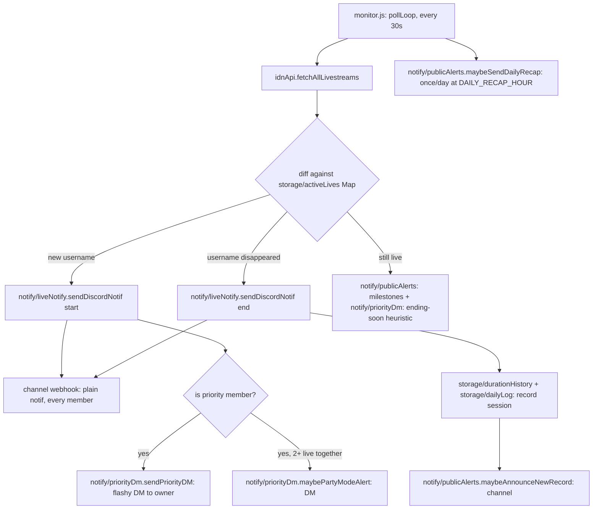

# Architecture

Technical reference for the JKT48 IDN Live Discord notifier. This document assumes no prior context — it should be enough for a new engineer to understand the system, extend it safely, and know where to look when something breaks.

## 1. What this system does

The bot polls IDN Live's public GraphQL API every 30 seconds for livestreams by JKT48 members, and reacts to state changes:

- A member **starts** live → post a notification to a Discord channel (via webhook), optionally with an extra "flashy" DM to the bot owner if that member is on the personal priority list.
- A member **ends** live → post an "ended" notification, record the session's duration/peak-viewer stats.
- Along the way: viewer-count milestones, new personal-duration records, a daily recap, and an optional interactive chat-command bot (`cok ...`) that reads the same data.

It is a single always-on Node.js process (no database — everything is small JSON files), designed to run on Railway with a persistent Volume.

## 2. Directory map

```
scripts/
  cek-top-gifter.js         standalone manual CLI (not part of the 24/7 bot —
                           see §6)
  backup-data.js             pulls a full data backup from the deployed bot
  backfill-live-history.js   one-time: reconstructs pre-2026-09-19 live
                           sessions from Discord's own notification message
                           history, pushes them to the deployed bot (§9)
src/
  index.js                 entry point — require("./app").start() (this is
                           what "node src/index.js"/npm start actually runs)
  config.js                env loading + validation + all static config
                           (thresholds, priority member definitions, colors)
  app.js                   start(): wires everything together, the only
                           module (besides index.js/config.js) with real side effects
  security.js               HMAC request-signing helpers (used by src/server.js
                           and scripts/cek-top-gifter.js) — a leaf module like
                           config.js/utils.js, no dependency on the rest of src/
  discordClient.js         shared discord.js Client singleton
  idnApi.js                IDN Live GraphQL client
  server.js                HTTP server (health check + signed endpoints)
  monitor.js               the poll loop — orchestrates idnApi + storage + notify
  utils.js                 pure helpers: formatting, WIB time, text matching
  storage/
    jsonStore.js             generic cached JSON-file load/save factory
    activeLives.js            in-memory Map of who's live right now
    durationHistory.js        per-member rolling history of live durations (last 10, for averages)
    liveCount.js               per-member TOTAL live count since the bot started (never pruned)
    dailyLog.js                append-only archive of completed sessions (today/weekly/monthly recap)
    priorityStore.js           raw persistence for custom priority members
    subscriptions.js           per-user "ping me when X goes live" subscriptions
    gifterSnapshot.js          top-gifter snapshots (pushed from scripts/cek-top-gifter.js)
  priority/
    index.js                  priority-member domain logic (who's priority,
                             the flashy embed builder, the random thank-you
                             message generator)
  notify/
    webhook.js                shared "POST to the channel webhook" helper
    liveNotify.js              the plain start/end channel notification
    priorityDm.js               owner-only DMs: flashy notif, ending-soon
                             heuristic, Party Mode
    publicAlerts.js             viewer milestones, new records, daily recap
    crashAlert.js                last-resort DM/webhook alert on an uncaught
                             error, sent right before the process exits
  chat/
    router.js                  buildChatReply() dispatcher + Discord event wiring
    replies.js                   pure reply-string builders + recap pagination
    menu.js                       fallback-menu UI + watch-confirm flow
    pendingState.js                short-lived per-user "waiting for a reply" state
data/                    JSON files (see §4) — local fallback; Railway uses a
                         mounted Volume instead (see §9)
tests/                   automated tests (see §10) — "npm test"
```

## 3. Data flow



The channel webhook (`DISCORD_WEBHOOK_URL`) is the only thing every server member sees. Everything under `notify/priorityDm.js` is a **DM to the owner only** — see §6.

## 4. Data model (`data/*.json`)

All files are cached in memory after first read (`storage/jsonStore.js`) and rewritten in full on every save — there's no database, so treat them as small enough to always fit in memory (they are, by design: duration history keeps only the last 10 entries per member, `daily-log.json` prunes anything older than 35 days).

**"Who's live right now" has exactly one source of truth: `active-lives-cache.json`.** `daily-log.json` only ever stores _completed_ sessions — it never duplicates the "is member X live" question. This wasn't always true: an earlier design tried to track both "open" and "closed" sessions in `daily-log.json` itself, which drifted out of sync with `active-lives-cache.json` twice in practice (see §10's bug notes) before being redesigned this way. Anywhere that needs "today's full picture" (ongoing + finished) merges the two at read time — see `chat/replies.js`'s `getTodaySessionsForRecap()`.

| File                         | Owner module                 | Shape                                                                                                                | Purpose                                                                                                                                                                                                                                                                                                                                                                                                                                                                                                                                                                                                                                                                                                                                                                                                                                                                                                                                                           |
| ---------------------------- | ---------------------------- | -------------------------------------------------------------------------------------------------------------------- | ----------------------------------------------------------------------------------------------------------------------------------------------------------------------------------------------------------------------------------------------------------------------------------------------------------------------------------------------------------------------------------------------------------------------------------------------------------------------------------------------------------------------------------------------------------------------------------------------------------------------------------------------------------------------------------------------------------------------------------------------------------------------------------------------------------------------------------------------------------------------------------------------------------------------------------------------------------------- |
| `active-lives-cache.json`    | `storage/activeLives.js`     | `{ [username]: { name, slug, liveAt, viewCount, peakViewCount, imageUrl, endingSoonAlerted, alertedMilestones[] } }` | Who's live right now — survives restarts so the bot doesn't re-announce a live already in progress. The single source of truth for "is member X live."                                                                                                                                                                                                                                                                                                                                                                                                                                                                                                                                                                                                                                                                                                                                                                                                            |
| `live-duration-history.json` | `storage/durationHistory.js` | `{ [username]: [{ name, durationMs, at }] }` (max 10 entries)                                                        | Last-10 completed lives per member. Powers `cok stats`, `cok kapan ... live`, and the ending-soon/new-record heuristics. `at` is the **end** timestamp, not start. Entries are kept sorted by `at` before slicing to 10, since `recordLiveDurationAt` (used by the backfill endpoint) can insert historical entries out of chronological order — `recordLiveDuration` (the normal live-tracking path) always appends the current moment, so this never mattered before backfilling existed.                                                                                                                                                                                                                                                                                                                                                                                                                                                                       |
| `live-count.json`            | `storage/liveCount.js`       | `{ [username]: { name, count, firstLiveAt, lastLiveAt } }`                                                           | TOTAL completed-live count per member, never pruned/capped (unlike `live-duration-history.json`'s last-10). Powers `cok berapa kali <nama> live`. Incremented once per completed live, alongside `recordLiveDuration`/`recordLiveEnded` in `monitor.js`.                                                                                                                                                                                                                                                                                                                                                                                                                                                                                                                                                                                                                                                                                                          |
| `daily-log.json`             | `storage/dailyLog.js`        | `{ sessions: [{ name, username, startedAtUnix, endedAtUnix, durationMs, peakViewCount }], recapSentDate }`           | Append-only archive of **completed** sessions only (pruned past 35 days) — written once, when a live ends, via `recordLiveEnded()`. `getCompletedSessionsToday()`/`getCompletedSessionsSince(daysBack)` filter by the WIB date (or a rolling window) of `endedAtUnix`. Powers `cok rekap`/`cok rekap minggu ini`/`cok rekap bulan ini`, `cok paling lama/rame` (today's variant merged with `activeLives` for the still-ongoing half; the weekly/monthly ones are closed historical windows, no merge). This archive only exists in this cross-day form since `16c4b7c` (2026-09-19) — before that, `dailyLog.js` reset `sessions` every WIB midnight, so nothing from before that rewrite can ever appear here. `getEarliestSessionDate()` exposes the archive's oldest record so `replyRecapRange()` can tell the user explicitly when a requested window (7/30 days) isn't fully covered yet, instead of silently showing a short recap that looks like a bug. |
| `custom-priority.json`       | `storage/priorityStore.js`   | `[{ rank, keyword, label, color, sirens }]`                                                                          | Priority members added via `cok tambah prioritas <nama>`, beyond the 3 hardcoded ones (Nala/Levi/Lily).                                                                                                                                                                                                                                                                                                                                                                                                                                                                                                                                                                                                                                                                                                                                                                                                                                                           |
| `subscriptions.json`         | `storage/subscriptions.js`   | `{ [keyword]: [userId, ...] }`                                                                                       | Per-user personal reminders (`cok ingetin <nama>`) — any member, any user, independent of the priority list.                                                                                                                                                                                                                                                                                                                                                                                                                                                                                                                                                                                                                                                                                                                                                                                                                                                      |
| `gifter-snapshot.json`       | `storage/gifterSnapshot.js`  | `{ members: { [username]: { name, gifters, checkedAt } } }`                                                          | Point-in-time top-gifter data, pushed from the local `cek-top-gifter` script (§6) — never fetched by the bot itself.                                                                                                                                                                                                                                                                                                                                                                                                                                                                                                                                                                                                                                                                                                                                                                                                                                              |

## 5. Chat command system (`src/chat/`)

`chat/router.js`'s `buildChatReply(text, {isBotChannel, channelId, authorId})` is the single entry point, called from `messageCreate`. Dispatch order matters:

1. **Pending-state shortcuts first** (checked before the wake-word gate, since none of these require saying "cok"): watch-confirm y/n (`chat/menu.js`), recap-page y/n (`chat/replies.js`), menu-shortcut digits (`chat/pendingState.js`), member-name-prompt follow-ups (`chat/pendingState.js`).
2. **Wake-word gate**: the message must contain "cok", OR be in the configured `BOT_CHANNEL_ID`, OR look like a live-related question (contains "live" + a question word/`?`).
3. A long chain of regex/keyword matches against `replies.js` functions, most-specific first (e.g. subscribe commands before the generic priority-list check, since their text overlaps).
4. Falls through to `chat/menu.js`'s `replyFallbackMenu()` — a numbered menu (buttons + typeable digits) rather than silence.

### The 4 short-lived pending-state maps

All keyed `` `${channelId}:${authorId}` `` (never just `channelId`) with a TTL, so two people talking in the same channel never cross-wire each other's in-progress flow:

| Map                   | Lives in               | Set when                                           | Consumed by                                                                                                                                                                       |
| --------------------- | ---------------------- | -------------------------------------------------- | --------------------------------------------------------------------------------------------------------------------------------------------------------------------------------- |
| `pendingWatchConfirm` | `chat/menu.js`         | User picks a live member (menu #4 or `"4 <nama>"`) | y/n → "gas nonton" or a status update                                                                                                                                             |
| `pendingRecapPage`    | `chat/replies.js`      | A recap table has more pages                       | y/n → next page (also carries `rangeDays` — `null` for today, `7`/`30` for weekly/monthly — so paginating a weekly recap doesn't silently switch to today's) or "oke, segitu aja" |
| `pendingMenuByAuthor` | `chat/pendingState.js` | Fallback menu was just shown                       | Bare digit 1-9                                                                                                                                                                    |
| `pendingMemberPrompt` | `chat/pendingState.js` | Menu #4/#9 picked with no name yet                 | Next message = the member name                                                                                                                                                    |

(This replaced an earlier per-channel-only key, which caused a second person's identical digit reply in a shared channel to be misrouted back to the menu instead of resolved — see git history around commit `aca7035`.)

## 6. Priority-member DM architecture

Nala/Levi/Lily (plus anything added via `cok tambah prioritas`) are the bot **owner's** personal favorites, not a server-wide setting. Since a webhook posts one identical message to everyone in the channel, there's no way to make the channel itself look different per viewer — so as of this session, the flashy treatment moved entirely to DMs:

- **Channel** (`notify/liveNotify.js`): every member, priority or not, gets the same plain start/end notification.
- **Owner DM** (`notify/priorityDm.js`, requires `DISCORD_BOT_TOKEN` + `PRIORITY_PING_USER_ID`): the flashy embed (colors, link button, Nala's randomized thank-you message), the "ending soon" duration heuristic, and "Party Mode" (2+ priority members live together) — all sent via `client.users.fetch(id).send(...)`, a private 1:1 DM channel nothing else in the server can read.

If `DISCORD_BOT_TOKEN` is unset, none of this fires — the bot logs that at boot and priority members just get the plain channel notification like anyone else. If it's set but `PRIORITY_PING_USER_ID` is empty, the same degradation happens (logged separately in `chat/router.js`'s `clientReady` handler, specifically so this is checkable from Railway's Deploy Logs alone without needing dashboard access).

`scripts/cek-top-gifter.js` also needs `BOT_API_URL` + `API_SECRET` (see §9) but is a **separate, manually-run** local tool — it is never part of the always-on bot process, since fetching top-gifter data requires a personal IDN login that must never live on a 24/7 server.

## 7. Extension points

- **New chat command**: add a `reply*` function to `chat/replies.js`, then a matcher in `chat/router.js`'s `buildChatReply` chain (order matters — put more specific patterns before broader ones). Add a line to `replyHelp()`.
- **New priority member**: no code change needed — `cok tambah prioritas <nama>` (owner only). To change the 3 hardcoded ones' behavior, edit `PRIORITY_MEMBERS` in `config.js`.
- **New storage domain**: add a file under `storage/`, call `createJsonStore(filePath, defaultValue, { errorLabel })` from `storage/jsonStore.js`, wrap with domain-specific functions. Always pair a `load()` with a `save()` after mutating — the cache assumes nothing mutates without saving.
- **New notification type**: decide first whether it belongs in the shared channel (`notify/liveNotify.js` / `notify/publicAlerts.js`, visible to everyone) or the owner's DM (`notify/priorityDm.js`, visible to nobody else) — see §6 for why that distinction matters.

## 8. Environment variables

| Variable                          | Required            | Default                                   | Effect                                                                                                                                                                                                                 |
| --------------------------------- | ------------------- | ----------------------------------------- | ---------------------------------------------------------------------------------------------------------------------------------------------------------------------------------------------------------------------- |
| `DISCORD_WEBHOOK_URL`             | **yes**             | —                                         | Bot exits at boot if missing. Channel notifications.                                                                                                                                                                   |
| `DISCORD_BOT_TOKEN`               | no                  | —                                         | Enables chat commands + priority owner DMs.                                                                                                                                                                            |
| `PRIORITY_PING_USER_ID`           | no                  | —                                         | Discord user ID that gets priority DMs and owns admin commands (`tambah/hapus prioritas`).                                                                                                                             |
| `API_SECRET`                      | no                  | —                                         | HMAC secret for `/api/status`, `/api/gifter-snapshot`, and `/api/backup`; those endpoints 503 without it.                                                                                                              |
| `CACHE_DIR`                       | no                  | `RAILWAY_VOLUME_MOUNT_PATH`, else `data/` | Where all JSON files live.                                                                                                                                                                                             |
| `RAILWAY_VOLUME_MOUNT_PATH`       | no (set by Railway) | —                                         | Persists data across redeploys when a Volume is attached.                                                                                                                                                              |
| `BOT_CHANNEL_ID`                  | no                  | —                                         | Channel where the bot replies without needing "cok"/"live".                                                                                                                                                            |
| `ENDING_SOON_THRESHOLD_MINUTES`   | no                  | `40`                                      | Fallback threshold (minutes) for the ending-soon DM heuristic when a member has no duration history yet.                                                                                                               |
| `DAILY_RECAP_HOUR`                | no                  | `23`                                      | WIB hour the automatic daily recap fires.                                                                                                                                                                              |
| `PORT`                            | no                  | `3000`                                    | HTTP health-check server port.                                                                                                                                                                                         |
| `BOT_API_URL`, `API_SECRET`       | no                  | —                                         | `scripts/cek-top-gifter.js` (push gifter snapshots), `scripts/backup-data.js` (pull a data backup), and `scripts/backfill-live-history.js` (push reconstructed historical sessions) — same two env vars, same bot URL. |
| `IDN_AUTH_TOKEN`, `IDN_X_API_KEY` | no                  | prompts interactively                     | `scripts/cek-top-gifter.js` only — personal IDN credentials, never touches the 24/7 bot.                                                                                                                               |

## 9. Deployment (Railway)

- `package.json`'s `main`/`scripts.start` point at `src/index.js` (a thin `require("./app").start()`), run via `npm start` — no separate `js/` entry point exists anymore, everything lives under `src/`.
- Attach a Railway **Volume** and Railway auto-populates `RAILWAY_VOLUME_MOUNT_PATH`; `config.js` picks it up automatically (no code change needed) so `data/*.json` survives redeploys instead of resetting.
- `config.js` logs which `CACHE_DIR` is actually active at boot — check Railway's Deploy Logs first if stats/history seem to have reset unexpectedly.
- The HTTP server (`src/server.js`) exists purely so Railway's health check sees an open port; the bot itself is a background poller, not a web service.
- **Graceful shutdown**: `src/app.js`'s `start()` registers `SIGTERM`/`SIGINT` handlers — on redeploy/restart, Railway sends `SIGTERM` and waits before force-killing. The handler stops `monitor.js`'s poll loop (`stopPolling()` — lets an in-flight cycle finish, just skips scheduling the next one), destroys the Discord client, and closes the HTTP server, with a 5-second fallback `process.exit(0)` in case something hangs. Look for `"SIGTERM diterima, matiin bot dengan rapi..."` in Deploy Logs right before a redeploy's old instance stops.
- **Crash alerts**: `start()` also registers `uncaughtException`/`unhandledRejection` handlers that call `notify/crashAlert.js`'s `sendCrashAlert()` (DM to the owner if `DISCORD_BOT_TOKEN`/`PRIORITY_PING_USER_ID` are set, else the public webhook channel) before exiting — a last-resort net for something that escapes `checkLiveMembers()`'s own per-cycle try/catch, so a real crash doesn't go silently unnoticed until you happen to check Deploy Logs.
- **Data backup**: a Railway Volume survives redeploys, but it's still the _only_ copy of the bot's data — there's no automatic off-Railway backup. `npm run backup-data` (`scripts/backup-data.js`, same manual-CLI category as `cek-top-gifter.js` — not part of the 24/7 bot) pulls everything from a new signed `GET /api/backup` endpoint (`src/server.js`'s `handleBackupExport` — read-only, aggregates every storage module's current `load()`) and writes it to a timestamped file under `backups/` (gitignored, same reasoning as `data/`). Run it manually whenever you want a snapshot; nothing calls it automatically.
- **Historical backfill**: local scripts can't write directly to a Volume mounted on Railway, so `scripts/backfill-live-history.js` follows the same push pattern as `cek-top-gifter.js` instead of touching files locally — it reads the bot's own notification-channel message history via `DISCORD_BOT_TOKEN` (the channel webhook messages are the only surviving record of live sessions from before `daily-log.json` became a real archive, see §10), **plus, if `PRIORITY_PING_USER_ID` is set, the bot's own DM thread with the owner** (priority-member "JANGAN SAMPE KETINGGALAN!" notifications moved there entirely after 2026-09-18, see §10's eighth bug entry — that history exists nowhere else), reconstructs start/end pairs locally from both sources combined, then `POST`s them to a signed `POST /api/backfill-live-history` (`src/server.js`'s `handleBackfillLiveHistory`) which does the actual writing on the Railway side. Defaults to a dry run (preview only, now also logging each reconstructed session's name/start/end/duration, not just a total count); `npm run backfill-live-history -- --apply` commits. Safe to re-run **as many times as needed** — each session is deduped individually against what's already in `daily-log.json` (same username, `endedAtUnix` within a small tolerance — see §10's twelfth bug for why this replaced an earlier date-cutoff approach that broke under repeated runs), so a repeat run can't double-insert a session it already recorded, but also won't wrongly reject a genuinely new session just because it falls in a period some other session already covered. The accepted sessions are written to **both** `daily-log.json` (via `recordLiveEnded`) **and** `live-duration-history.json` (via `recordLiveDurationAt`, with the session's real historical end time — see §10's fifth bug entry for why the first version of this endpoint missed the second file) — `live-count.json` alone is rebuilt from every valid session received, not just the newly-accepted ones, since it covers the whole timeline by design (see the code comment in `rebuildLiveCountFromSessions`).
- **Repairing already-corrupted history**: if `backfill-live-history.js --apply` was run before the ninth-bug fix (§10) existed, the bad implausible-duration sessions it wrote are still sitting in Railway's Volume — fixing the reconstruction logic only stops _new_ corruption, it doesn't retroactively clean what's already there. `npm run repair-live-history -- --apply` (`scripts/repair-live-history.js`, same manual-CLI/dry-run-by-default pattern, needs only `BOT_API_URL`/`API_SECRET`) calls a signed `POST /api/repair-live-history` (`handleRepairLiveHistory`) that strips any `daily-log.json`/`live-duration-history.json` entry whose duration exceeds `MAX_PLAUSIBLE_LIVE_DURATION_MS`, then rebuilds `live-count.json` from what's left. Safe to run more than once — a second run reports 0 removed once the corrupted entries are gone.

### Troubleshooting: dashboard stuck showing "Building"

Railway's deploy badge can keep showing **"Building"** even after the **Build Logs** tab clearly finished (look for a green checkmark on `exporting to docker image format` and `image push` near the bottom — if those are there, the image itself built fine). This is almost always one of two things, in order of likelihood:

1. **The dashboard just hasn't refreshed.** Build finished, deploy is already progressing (or done), the badge is stale. Reload the page.
2. **The container is crashing right after start**, which Railway can sometimes still render as a lingering "Building" state before it flips to "Failed" or starts crash-looping. To tell the difference from (1):
   - Open the **Deploy Logs** tab (next to Build Logs) — that's where the actual `node src/index.js` process's output goes, not Build Logs.
   - Look for the boot sequence: `CACHE_DIR aktif: ...`, then `Bot notifikasi IDN Live jalan...`, and (if `DISCORD_BOT_TOKEN` is set) `Bot tanya-jawab login sebagai ...`. If all of these show up, the bot is actually running fine and the dashboard badge was just stale (case 1).
   - If Deploy Logs instead show a stack trace / `Error: Cannot find module ...` / the process exiting immediately, that's a real crash — paste that log, not the Build Logs, for diagnosis.

Things already verified as **not** the cause of this (so don't re-check them from scratch next time this happens, unless the codebase changes again in a way that could reintroduce them):

- Case-sensitivity of every `require()` path vs. the actual on-disk filename (Windows-dev/Linux-prod mismatches silently pass locally but crash on Railway) — audited with a small Node script that walks every `.js` file, resolves each relative `require()`, and compares it case-sensitively against `fs.readdirSync()` output.
- `package.json`'s `main`/`scripts.start` pointing at a real, existing file (`src/index.js`).
- No `Dockerfile`/`nixpacks.toml`/`railway.json`/`Procfile` overriding the start command — `package.json` is the only place it's declared.

## 10. Testing

`npm test` runs `node --test` (Node's built-in test runner — zero new dependencies, matches the project's existing "no framework unless it earns its weight" approach). Test files live under `tests/*.test.js`.

**CI**: `.github/workflows/test.yml` runs `npm test` on every push and pull request. **This gives visibility, not a deploy gate** — this repo's workflow is direct pushes to `master` with no branch protection or PR step, and Railway's deploy trigger isn't gated on GitHub Actions status by default. A failing test shows up as a red X on the commit on GitHub, but it does **not** by itself stop that commit from being deployed to Railway. Making it an actual gate would mean adding branch protection + a PR-based workflow, or a Railway-side check — neither is set up, since it'd change how this project is worked on day to day.

**Lint & format**: `npm run lint` (ESLint, flat config in `eslint.config.js`) catches real bugs (unused vars, undefined references, etc.) — `no-console` is deliberately off, since `console.log`/`console.error` to Railway's log stream is this codebase's entire logging strategy, not a leftover debug statement. `npm run format`/`format:check` (Prettier, `.prettierrc`) handles pure style, configured to match the codebase's existing conventions (double quotes, semicolons, a wide 150-char `printWidth` so the many long explanatory comments don't get hard-wrapped). Neither is wired into CI yet — they're available as local tools, run manually before a commit.

**Coverage is deliberately targeted, not exhaustive** — it covers the pure logic and storage behavior that's already proven fragile in practice (things this project has actually gotten wrong before), not every function in the codebase:

| File                                | What it covers                                                                                                                                                                                                                                                                                                                                                                                                                                                                                                                                                                                                                                                                                                                                                                                                                                                                                                                                                                                                                                                                                                                                                                                                                                   |
| ----------------------------------- | ------------------------------------------------------------------------------------------------------------------------------------------------------------------------------------------------------------------------------------------------------------------------------------------------------------------------------------------------------------------------------------------------------------------------------------------------------------------------------------------------------------------------------------------------------------------------------------------------------------------------------------------------------------------------------------------------------------------------------------------------------------------------------------------------------------------------------------------------------------------------------------------------------------------------------------------------------------------------------------------------------------------------------------------------------------------------------------------------------------------------------------------------------------------------------------------------------------------------------------------------ |
| `tests/utils.test.js`               | Pure formatting/text/WIB-time helpers.                                                                                                                                                                                                                                                                                                                                                                                                                                                                                                                                                                                                                                                                                                                                                                                                                                                                                                                                                                                                                                                                                                                                                                                                           |
| `tests/jsonStore.test.js`           | The generic cache/load/save factory: default fallback, corrupt-file recovery, mkdir-on-save, persistence across a fresh instance (simulating a restart).                                                                                                                                                                                                                                                                                                                                                                                                                                                                                                                                                                                                                                                                                                                                                                                                                                                                                                                                                                                                                                                                                         |
| `tests/dailyLog.test.js`            | `recordLiveEnded` appending completed sessions correctly, `getCompletedSessionsToday`'s date filtering (including the cross-midnight case), `getCompletedSessionsSince`'s rolling-window filtering, `getEarliestSessionDate`, the legacy-shape migration filter, and the 35-day retention pruning.                                                                                                                                                                                                                                                                                                                                                                                                                                                                                                                                                                                                                                                                                                                                                                                                                                                                                                                                               |
| `tests/liveCount.test.js`           | `recordLiveCompleted`'s per-username counting (increments correctly, `firstLiveAt` never changes after the first record, `lastLiveAt`/`name` update on later ones, members don't cross-contaminate each other's counts), and `findLiveCountByNameFragment`'s fuzzy lookup.                                                                                                                                                                                                                                                                                                                                                                                                                                                                                                                                                                                                                                                                                                                                                                                                                                                                                                                                                                       |
| `tests/priority.test.js`            | Custom priority add/remove validation, and `buildPriorityPayload`'s mention/end-message behavior.                                                                                                                                                                                                                                                                                                                                                                                                                                                                                                                                                                                                                                                                                                                                                                                                                                                                                                                                                                                                                                                                                                                                                |
| `tests/replies.test.js`             | `buildRecapTablePage` — sorting, pagination, and the cross-midnight "(DD/MM)" date marker — plus `getTodaySessionsForRecap`'s merge, `replyRecapRange`'s aggregation (and that it does _not_ merge `activeLives`, unlike the today variant) plus its "archive not fully covered yet" note, `tryHandleRecapPageShortcut`'s forward/backward page navigation (including rejecting "y" past the last page and "mundur" before the first, and that "n" still cancels outright — §10's eleventh bug), `replyLiveCount`, `replyMemberStats`/`replySchedulePattern`'s bucket/weekday logic, `replyPriorityList`, subscribe/unsubscribe, and the owner-gated priority add/remove.                                                                                                                                                                                                                                                                                                                                                                                                                                                                                                                                                                        |
| `tests/router.test.js`              | `buildChatReply`'s dispatch chain — the wake-word gate, the explicitly order-sensitive regex pairs ("reminder" before "ingetin", "berhenti ingetin" before "ingetin", "rekap minggu/bulan" before plain "rekap"), one case per major command branch, both directions of `"berapa kali <nama> live"` (keyword-first and name-first, including the "cok" wake-word-not-swallowed-into-the-name regression), and the fallback-menu path. Deliberately skips anything that dispatches to `replyTodayRecapSoFar` (menu option 8 / "cok rekap"), since that makes a real network call to the external archive — see `tests/menu.test.js`'s note; `replyRecapRange` has no such network call, so the weekly/monthly recap dispatch tests exercise the real function.                                                                                                                                                                                                                                                                                                                                                                                                                                                                                    |
| `tests/menu.test.js`                | `resolveBareMenuChoice`'s dispatch table, the watch-confirm y/n flow (including re-checking live status at confirm time, and a non-y/n answer not consuming the pending state), and the button/select-menu handlers via lightweight fake `interaction` objects (`{ customId, channelId, user: { id }, values, reply }` — the code never touches anything else on a real discord.js interaction, so no mocking library is needed).                                                                                                                                                                                                                                                                                                                                                                                                                                                                                                                                                                                                                                                                                                                                                                                                                |
| `tests/monitor.test.js`             | `stopPolling()` is safe to call before any poll cycle has run, and idempotent. Deliberately doesn't exercise `pollLoop()` itself — it calls the real IDN API.                                                                                                                                                                                                                                                                                                                                                                                                                                                                                                                                                                                                                                                                                                                                                                                                                                                                                                                                                                                                                                                                                    |
| `tests/crashAlert.test.js`          | `sendCrashAlert()` never throws, for both an `Error` object and a bare string reason (the two shapes `uncaughtException`/`unhandledRejection` can hand it) — exercises the real webhook-fallback path against the dummy test webhook URL (a fast, deterministic rejection from Discord's real API, not a flaky third party) rather than mocking `fetch`.                                                                                                                                                                                                                                                                                                                                                                                                                                                                                                                                                                                                                                                                                                                                                                                                                                                                                         |
| `tests/server.test.js`              | The HTTP server, started for real on an OS-assigned local port (no external traffic — health check and `/api/*` are pure localhost) — signed vs. unsigned `/api/backup` requests, the backup response shape, that `/` stays unauthenticated, and `/api/backfill-live-history`'s dry-run/apply modes, invalid-session filtering, the implausible-duration server-side rejection (§10's ninth bug), the per-session dedup idempotency (calling it twice with the same sessions doesn't double-insert, a genuinely new session from an already-covered period is still accepted, and a near-duplicate a few seconds off from an existing session is still caught — §10's twelfth bug), and that accepted sessions also land in `live-duration-history.json` with their real historical `at` timestamp (not "now"); plus `/api/repair-live-history`'s dry-run/apply modes, that it strips implausible-duration entries from both `daily-log.json` and `live-duration-history.json`, and that dry-run genuinely changes nothing. The backfill/repair-writing tests use a fresh, isolated server/storage instance (`freshStartServerForBackfillTest`) so exact-count assertions don't depend on what earlier tests in the same file happened to write. |
| `tests/backfillLiveHistory.test.js` | `scripts/backfill-live-history.js`'s pure logic (no real Discord/network calls) — `extractWebhookIds`, `parseEvents`'s message-format matching and webhook-identity filtering (both the plain `content` format and the old priority embed format via `parsePriorityEmbedEvent`, and that both can be parsed together from the same channel history), `parseDmEvents`'s author-identity filtering for the post-cutover priority DM thread, and `reconstructSessions`'s single-open-slot-per-name start/end pairing — including concurrent different-member lives, unmatched start/end edge cases, the duplicate/orphaned-start regression (a second "start" for the same name before its "end" must NOT get paired with a much-later "end", see §10's ninth bug), and the `MAX_PLAUSIBLE_LIVE_DURATION_MS` sanity-cap filtering into `discardedSessions`.                                                                                                                                                                                                                                                                                                                                                                                         |

**Isolation**: `tests/helpers/setupTestEnv.js` points `CACHE_DIR` at a fresh OS temp folder (and blanks `DISCORD_BOT_TOKEN`/`PRIORITY_PING_USER_ID`/`BOT_CHANNEL_ID`) _before_ any `src/` module is required, so tests never read or write the real `data/` folder. It must be the first `require` in any test file that touches storage — `src/config.js` is a singleton cached by Node's `require`, so if some other module reads it first, the temp `CACHE_DIR` override arrives too late. `node --test` runs each test file as its own process, so this isolation doesn't leak between files.

**A test caught a real bug while this suite was being written**: `getHourWIBOf()` used `Intl.DateTimeFormat({ hour12: false })`, which has an ICU quirk — it returns `"24"` instead of `"0"` for the _entire_ 00:00–00:59 WIB hour, not just the instant of midnight. `notify/publicAlerts.js`'s `maybeSendDailyRecap()` checks `getHourWIBOf() < DAILY_RECAP_HOUR` (default `23`) to skip early; during that hour, `24 < 23` is `false`, so it fell through, found no sessions yet (the day had just rolled over), skipped posting — but still stamped `recapSentDate = log.date`, silently marking that day's recap as already sent before it had even started. The real 23:00 recap for that day would then never fire, with no error anywhere. Fixed with `% 24` in `utils.js`'s `getHourWIBOf()`; guarded by the `tests/utils.test.js` regression test that checks every minute of that hour explicitly.

**A second and third bug, reported by the owner directly** (a member who was still live wasn't showing up in `cok rekap` — twice, even after the first fix): `daily-log.json` used to track "open" sessions (`endedAtUnix === null`) as a second representation of "is member X live," parallel to `active-lives-cache.json`. The day-rollover logic dropped _every_ session on a WIB date change, including open ones - a live spanning midnight would vanish from the recap until it ended. That was patched twice (carry over open sessions across rollover, then a poll-cycle self-heal reconciliation) before the actual root cause was addressed: **`daily-log.json` no longer stores open sessions at all.** `active-lives-cache.json` is now the single source of truth for "who's live right now"; `daily-log.json` is a plain append-only archive of completed sessions, written once via `recordLiveEnded()` when a live ends. Anything needing "today's full picture" merges the two at read time (`chat/replies.js`'s `getTodaySessionsForRecap()`) - there's no second copy of live-tracking state left to drift out of sync. Guarded by `tests/dailyLog.test.js` and the merge test in `tests/replies.test.js`.

**A fourth bug report turned out not to be a bug**: the owner noticed `cok rekap minggu ini`/`cok rekap bulan ini` only showing the last few days despite the bot running much longer, and suspected the monthly recap was reusing the weekly one's filtering logic. `getCompletedSessionsSince`'s rolling-window math and the router's `minggu`→7/`bulan`→30 dispatch were both re-verified correct. The actual cause, found via `git log` on `dailyLog.js`: the cross-day archive this feature depends on didn't exist yet for most of the bot's history — `daily-log.json` reset its `sessions` array on every WIB midnight from the bot's first commit until the data-model unification rewrite above, an hour before the weekly/monthly recap feature was even added. Nothing from before that rewrite could ever have survived into the archive, so both windows were - correctly - capped at the same earliest date, which is why they looked like they shared logic. Since that history genuinely can't be recovered from the bot's own data, the fix isn't in the filter (nothing was wrong there): `getEarliestSessionDate()` lets `replyRecapRange()` detect when the archive's oldest record is more recent than the requested window and append a note explaining why, instead of a short recap silently looking broken. Separately, the owner found that Discord itself still had every notification message the bot had ever posted to the channel, going back to day one — so `scripts/backfill-live-history.js` (§9) reconstructs the missing sessions from that message history and backfills them, closing the gap for real rather than just explaining it away.

**A fifth and sixth bug were reported together, right after the backfill above shipped**: (1) `"Lily berapa kali live?"` replied `"Lily lagi nggak live sekarang"` instead of a count — `router.js`'s `liveCountMatch` only had one direction, `"berapa kali <nama> live"` (keyword before name); the user's phrasing put the name first, so it fell all the way through to the `findDurationHistoryByNameFragment` fallback. Fixed by adding a second, name-first alternative — matched against a `commandText` with the leading `"cok"` wake word stripped first, since an unanchored capture group placed before a literal keyword (unlike every other command's keyword-first patterns) would otherwise swallow `"cok"` into the captured name. (2) `"cok kapan lily live?"` only showed 1 tracked live despite 3 known from the backfilled history — the backfill endpoint (previous bug entry) only ever wrote to `daily-log.json` and rebuilt `live-count.json`; it never touched `live-duration-history.json`, which is what `cok stats`/`cok kapan ... live` actually read. Fixed by also calling a new `recordLiveDurationAt()` (§4) for each accepted session, using the session's real historical end time rather than "now" (which `recordLiveDuration` always uses) so the reconstructed entries don't distort the day/time-of-day pattern `replySchedulePattern` computes from them. A follow-up fix decoupled that duration-history write from daily-log's cutoff entirely (dedup by exact `at` already present per username, independent of daily-log's own cutoff) — the first version reused the same cutoff-filtered list for both, which meant a user who'd already run `--apply` once before this fix existed couldn't fix it by simply re-running: daily-log's cutoff had already moved past those sessions.

**A seventh bug, and the most consequential one**: the owner correctly guessed the root cause themselves - priority members (Nala/Levi/Lily/custom) still had zero backfilled history, and they suspected it was because "the notification type is different" for them. They were right. `git log` on the priority code confirms it: before commit `0bd317e` (2026-09-18 11:40 WIB - notably, _after_ several days of the bot already running), priority-member channel notifications used the flashy **embed** format (`priority/index.js`'s `buildPriorityPayload` - colors, a link button, member name inside `embeds[0].description`/title, not in `content`) posted to the same public channel; that commit is what moved the flashy version to a DM-only feature and made the channel always use the plain `buildNormalPayload` text format for everyone. `scripts/backfill-live-history.js`'s parser only ever checked `message.content` against the plain format's regex, so **every priority-member live from before that commit was silently invisible to it** - not a small gap, since Nala/Levi/Lily are exactly the members most likely to have been live early and often. Fixed with `parsePriorityEmbedEvent()`, a second detector that reads `message.embeds[0]` (title/description/url) for the old format and feeds the same `{type, name, username, atMs}` shape into the same event list - `reconstructSessions()` needed no changes at all, since pairing logic is format-agnostic once the two parsers normalize to the same event shape.

**An eighth bug, the other half of the same story**: even after the seventh fix, priority-member history from _after_ 0bd317e (2026-09-18 11:40 WIB onward - the majority of the bot's runtime by then) was still missing. The commit above didn't just change the embed's format, it changed its **destination**: `notify/priorityDm.js`'s `sendPriorityDM()` sends the flashy "JANGAN SAMPE KETINGGALAN!" embed as a **DM** (`client.users.fetch(PRIORITY_PING_USER_ID).send(...)`) straight to the owner, never through the shared webhook channel at all. `scripts/backfill-live-history.js` only ever fetched the one guild channel resolved from `DISCORD_WEBHOOK_URL` - that DM thread was a second, entirely separate message history it never looked at. Fixed by adding `parseDmEvents()`, which fetches the bot's own DM channel with `PRIORITY_PING_USER_ID` (`user.createDM()` + the same paginated `fetchAllMessages()` used for the guild channel) and reuses `parsePriorityEmbedEvent()` against it - the DM always uses the embed format, so no third parser was needed, just a different "who do I trust this message from" check (`message.author.id === client.user.id`, since DMs aren't sent via webhook and have no `webhookId`). `main()` now merges channel events and DM events into one sorted list before `reconstructSessions()` runs, so a member's start (DM, post-0bd317e) can still pair correctly with their end (also DM) or, for a live spanning the cutover, even one of each kind.

**A ninth bug, and the most severe one yet**: the owner reported sessions with durations over 100 hours showing up across the recap _and_ `live-count`/`live-duration-history` - not a small handful, but "basically every member's numbers are broken." Root cause: `reconstructSessions()`'s pairing was a FIFO **queue** per member name - every unmatched "start" got pushed onto an array, and each "end" always shifted off the _oldest_ one. That's correct only if starts and ends for a given member always alternate perfectly. They don't always: if a "start" notification ever got sent twice for the same live (e.g. the bot restarting mid-live and re-detecting the member as newly live - exactly the kind of duplicate notification this project has hit before, see the crash-recovery/graceful-shutdown work in §9), the queue grows to length 2, and the next "end" pairs with the _wrong_ (older, already-closed) start - producing a session that spans from some earlier live all the way to this end, sometimes days later. Worse, this is a **cascading** bug: the newer, unconsumed start stays queued for the _next_ end, so a single duplicate near the start of a member's history can poison every session reconstructed for them afterward, which matches what the owner saw ("many members, durations totally broken"). Fixed in two layers: (1) `reconstructSessions()` now tracks **one open session per name**, not a queue - a new "start" while one is already open closes out (orphans) the old one into `unmatchedStarts` instead of leaving it to be mismatched later, so an "end" always pairs with the _most recent_ start; (2) a new `MAX_PLAUSIBLE_LIVE_DURATION_MS` sanity cap (`config.js`, 12 hours - generous given real sessions here are minutes to a couple hours) is checked in three independent places - client-side in `reconstructSessions()` (discarded into a new `discardedSessions` list, logged so the gap is visible), server-side in `handleBackfillLiveHistory`'s `validSessions` filter (defense in depth against any future data source), and retroactively via a new **repair** endpoint/script for data that was already written to Railway before this fix existed (`POST /api/repair-live-history`, `src/server.js`'s `handleRepairLiveHistory` - strips implausible-duration entries from `daily-log.json` and `live-duration-history.json`, then rebuilds `live-count.json` from what's left; `scripts/repair-live-history.js`, same manual-CLI/dry-run-by-default pattern as `backfill-live-history.js`). The owner needs to run `npm run repair-live-history -- --apply` once against the already-corrupted Railway data - the reconstruction fix alone only prevents _new_ corruption, it can't retroactively un-corrupt what an earlier `--apply` run already wrote.

**A tenth bug, found by the owner investigating the ninth**: while checking how many priority "JANGAN SAMPE KETINGGALAN!" notifications existed (`scripts/count-priority-notifs.js`, a new read-only script - raw keyword search on `message.content` plus a structured `parsePriorityEmbedEvent` parse, cross-checked against each other), a literal keyword search found 10 matching messages in the channel, but the structured parse found **zero**. `git log -S` on the description string (`src/priority/index.js`) turned up a second format change that the seventh-bug fix hadn't accounted for: `embeds[0].description` itself changed shape twice, not once. From the priority feature's introduction (`73ddeba`, 2026-09-13 19:13 WIB) until `b595d90` (2026-09-17 21:49 WIB, when the manual "TONTON SEKARANG" link was replaced by a real button), the description was `**Name** baru aja mulai live di IDN Live.\n\n[🔴 **TONTON SEKARANG**](url)` - link text and all. Only after `b595d90` did it shrink to just `**Name** baru aja mulai live di IDN Live.`, which is the only shape `PRIORITY_START_DESC_RE` was ever written to match (it anchored with `$` right at the end of that sentence). Since JS's `$` without the `m` flag matches only the very end of the whole string, the regex silently rejected every message from those first ~4 days - not a partial miss, a **complete** one for that entire window, which is exactly the period right after the bot went live when priority members would have been getting checked most. Fixed by dropping the trailing `$` anchor (the leading `^` plus the fixed prefix is enough to identify the format; anything after "di IDN Live." is now ignored rather than required to be absent). `scripts/count-priority-notifs.js` also got a `unparsed` dump - keyword matches that still fail structured parsing print their raw `content`/`embed.title`/`embed.description`/`embed.url` instead of silently vanishing from the count, so a future format change surfaces the same way this one did rather than needing another owner-side investigation to notice. Since this regex is shared with `backfill-live-history.js`'s actual reconstruction, any priority-member sessions from that ~4-day window were also silently absent from a prior `--apply` run - re-running `npm run backfill-live-history -- --apply` after this fix deploys should pick them up (idempotently, same as always - no `repair` step needed here, since this was a coverage gap, not corrupted data like the ninth bug).

**An eleventh bug/gap, a UX report rather than a data bug**: the owner relayed a user question about `cok rekap minggu ini`/`cok rekap bulan ini`'s paginated table - "isn't there a way to go back a page?" There wasn't. `pendingRecapPage` only ever stored `nextPage`, and was only set when `buildRecapTablePage`'s `hasMore` was true (i.e. there was a page after the current one) - so once someone paged forward to the _last_ page, `hasMore` became `false`, no pending state was created for it, and there was no way to navigate backward from there (or from any page, since "backward" was never implemented at all - the only recognized reply was "y" for forward and "n" to cancel, both via the existing `YES_PATTERN`/`NO_PATTERN`). Fixed by reworking the pending state to store `currentPage`/`totalPages` and stay alive for as long as `totalPages > 1`, regardless of `hasMore` - so it now exists on every page of a multi-page recap, including the last one. Added a new `PREV_PAGE_PATTERN` (`utils.js` - "mundur"/"balik"/"kembali"/"sebelumnya"/"prev"/"previous"/"back") kept deliberately separate from `NO_PATTERN`, since `chat/menu.js`'s watch-confirm flow also reuses `YES_PATTERN`/`NO_PATTERN` for an unrelated y/n question ("mau nonton?") where "n" has to keep meaning "cancel," not "go back a page." `tryHandleRecapPageShortcut` now branches on next/prev/stop, and answers "y" past the last page or "mundur" before the first with a plain-language explanation instead of silently no-op'ing or falling through to the wake-word gate. The per-page footer text also changed to name whichever direction(s) are actually available on that page, so most users won't need to ask whether going back is possible at all. A follow-up request added `NEXT_PAGE_PATTERN` ("maju"/"forward"/"lanjut"/"next"/"berikutnya") as a more explicit alternative to bare "y" for the forward direction — additive, not a replacement, so "y" keeps working exactly as before.

**A twelfth bug, the deepest one in this whole backfill saga**: after the seventh/eighth/tenth-bug fixes (priority embed parsing, DM history, the description-format regex) all landed, the owner asked why Nala/Levi/Lily's pre-2026-09-19 lives _still_ never showed up in `cok rekap` even though `count-priority-notifs.js` could now find and parse the notifications correctly. The parsing was fine - the problem was `handleBackfillLiveHistory`'s idempotency check itself. It used a **date cutoff**: `getEarliestSessionDate()` (the oldest `endedAtUnix` currently in `daily-log.json`) as a hard line, accepting only sessions ending before that line. That's fine for a _single_ backfill run filling a gap once - but this project ended up needing **multiple** backfill runs over the _same_ early period, as each parser bug was found and fixed in turn (bugs seven, eight, and ten all touched sessions from the same 2026-09-13 to 2026-09-18 window). The first successful run (even backfilling just a handful of non-priority sessions) pulled the cutoff forward to cover that whole window - so every subsequent run, no matter how correctly it now parsed the priority notifications, had every one of its newly-found sessions rejected outright, because their `endedAtUnix` fell "after" a cutoff that had already swallowed the entire period. This is exactly why the ninth/tenth-bug fixes could be verified as _parsing_ correctly (via `count-priority-notifs.js`, which never touches the cutoff) while still never actually reaching the recap. Fixed by replacing the whole cutoff concept with **per-session dedup**: before inserting, every incoming session is checked against existing `daily-log.json` entries for the same `username` with an `endedAtUnix` within `SESSION_DEDUP_TOLERANCE_SEC` (120 seconds - `src/server.js`, generous enough to absorb the few seconds of drift between the live-tracker's `Date.now()` at detection time and a Discord message's `createdTimestamp`, but far shorter than the hours/days between any two genuinely different lives of the same member). A session either matches something already there (skipped, no matter its date) or it doesn't (accepted, no matter its date) - there's no longer any global "boundary" for new discoveries to fall on the wrong side of. `cutoffDateWIB` was dropped from the endpoint's response entirely, since it no longer means anything.
