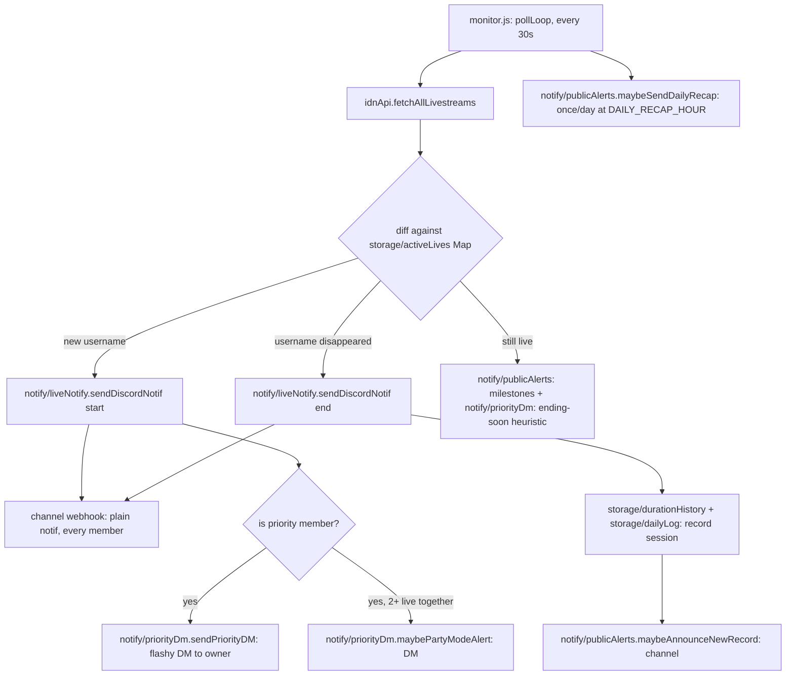

# Architecture

Technical reference for the JKT48 IDN Live Discord notifier. This document assumes no prior context — it should be enough for a new engineer to understand the system, extend it safely, and know where to look when something breaks.

## 1. What this system does

The bot polls IDN Live's public GraphQL API every 30 seconds for livestreams by JKT48 members, and reacts to state changes:

- A member **starts** live → post a notification to a Discord channel (via webhook), optionally with an extra "flashy" DM to the bot owner if that member is on the personal priority list.
- A member **ends** live → post an "ended" notification, record the session's duration/peak-viewer stats.
- Along the way: viewer-count milestones, new personal-duration records, a daily recap, and an optional interactive chat-command bot (`cok ...`) that reads the same data.

It is a single always-on Node.js process (no database — everything is small JSON files), designed to run on Railway with a persistent Volume.

## 2. Directory map

```
scripts/
  cek-top-gifter.js        standalone manual CLI (not part of the 24/7 bot —
                           see §6)
src/
  index.js                 entry point — require("./app").start() (this is
                           what "node src/index.js"/npm start actually runs)
  config.js                env loading + validation + all static config
                           (thresholds, priority member definitions, colors)
  app.js                   start(): wires everything together, the only
                           module (besides index.js/config.js) with real side effects
  security.js               HMAC request-signing helpers (used by src/server.js
                           and scripts/cek-top-gifter.js) — a leaf module like
                           config.js/utils.js, no dependency on the rest of src/
  discordClient.js         shared discord.js Client singleton
  idnApi.js                IDN Live GraphQL client
  server.js                HTTP server (health check + signed endpoints)
  monitor.js               the poll loop — orchestrates idnApi + storage + notify
  utils.js                 pure helpers: formatting, WIB time, text matching
  storage/
    jsonStore.js             generic cached JSON-file load/save factory
    activeLives.js            in-memory Map of who's live right now
    durationHistory.js        per-member rolling history of live durations
    dailyLog.js                today's sessions (for recap/stats commands)
    priorityStore.js           raw persistence for custom priority members
    subscriptions.js           per-user "ping me when X goes live" subscriptions
    gifterSnapshot.js          top-gifter snapshots (pushed from scripts/cek-top-gifter.js)
  priority/
    index.js                  priority-member domain logic (who's priority,
                             the flashy embed builder, the random thank-you
                             message generator)
  notify/
    webhook.js                shared "POST to the channel webhook" helper
    liveNotify.js              the plain start/end channel notification
    priorityDm.js               owner-only DMs: flashy notif, ending-soon
                             heuristic, Party Mode
    publicAlerts.js             viewer milestones, new records, daily recap
    crashAlert.js                last-resort DM/webhook alert on an uncaught
                             error, sent right before the process exits
  chat/
    router.js                  buildChatReply() dispatcher + Discord event wiring
    replies.js                   pure reply-string builders + recap pagination
    menu.js                       fallback-menu UI + watch-confirm flow
    pendingState.js                short-lived per-user "waiting for a reply" state
data/                    JSON files (see §4) — local fallback; Railway uses a
                         mounted Volume instead (see §9)
tests/                   automated tests (see §10) — "npm test"
```

## 3. Data flow



The channel webhook (`DISCORD_WEBHOOK_URL`) is the only thing every server member sees. Everything under `notify/priorityDm.js` is a **DM to the owner only** — see §6.

## 4. Data model (`data/*.json`)

All files are cached in memory after first read (`storage/jsonStore.js`) and rewritten in full on every save — there's no database, so treat them as small enough to always fit in memory (they are, by design: duration history keeps only the last 10 entries per member, `daily-log.json` prunes anything older than 35 days).

**"Who's live right now" has exactly one source of truth: `active-lives-cache.json`.** `daily-log.json` only ever stores _completed_ sessions — it never duplicates the "is member X live" question. This wasn't always true: an earlier design tried to track both "open" and "closed" sessions in `daily-log.json` itself, which drifted out of sync with `active-lives-cache.json` twice in practice (see §10's bug notes) before being redesigned this way. Anywhere that needs "today's full picture" (ongoing + finished) merges the two at read time — see `chat/replies.js`'s `getTodaySessionsForRecap()`.

| File                         | Owner module                 | Shape                                                                                                                | Purpose                                                                                                                                                                                                                                                                                                        |
| ---------------------------- | ---------------------------- | -------------------------------------------------------------------------------------------------------------------- | -------------------------------------------------------------------------------------------------------------------------------------------------------------------------------------------------------------------------------------------------------------------------------------------------------------- |
| `active-lives-cache.json`    | `storage/activeLives.js`     | `{ [username]: { name, slug, liveAt, viewCount, peakViewCount, imageUrl, endingSoonAlerted, alertedMilestones[] } }` | Who's live right now — survives restarts so the bot doesn't re-announce a live already in progress. The single source of truth for "is member X live."                                                                                                                                                         |
| `live-duration-history.json` | `storage/durationHistory.js` | `{ [username]: [{ name, durationMs, at }] }` (max 10 entries)                                                        | Last-10 completed lives per member. Powers `cok stats`, `cok kapan ... live`, and the ending-soon/new-record heuristics. `at` is the **end** timestamp, not start.                                                                                                                                             |
| `daily-log.json`             | `storage/dailyLog.js`        | `{ sessions: [{ name, username, startedAtUnix, endedAtUnix, durationMs, peakViewCount }], recapSentDate }`           | Append-only archive of **completed** sessions only (pruned past 35 days) — written once, when a live ends, via `recordLiveEnded()`. `getCompletedSessionsToday()` filters by the WIB date of `endedAtUnix`. Powers `cok rekap`, `cok paling lama/rame` (merged with `activeLives` for the still-ongoing half). |
| `custom-priority.json`       | `storage/priorityStore.js`   | `[{ rank, keyword, label, color, sirens }]`                                                                          | Priority members added via `cok tambah prioritas <nama>`, beyond the 3 hardcoded ones (Nala/Levi/Lily).                                                                                                                                                                                                        |
| `subscriptions.json`         | `storage/subscriptions.js`   | `{ [keyword]: [userId, ...] }`                                                                                       | Per-user personal reminders (`cok ingetin <nama>`) — any member, any user, independent of the priority list.                                                                                                                                                                                                   |
| `gifter-snapshot.json`       | `storage/gifterSnapshot.js`  | `{ members: { [username]: { name, gifters, checkedAt } } }`                                                          | Point-in-time top-gifter data, pushed from the local `cek-top-gifter` script (§6) — never fetched by the bot itself.                                                                                                                                                                                           |

## 5. Chat command system (`src/chat/`)

`chat/router.js`'s `buildChatReply(text, {isBotChannel, channelId, authorId})` is the single entry point, called from `messageCreate`. Dispatch order matters:

1. **Pending-state shortcuts first** (checked before the wake-word gate, since none of these require saying "cok"): watch-confirm y/n (`chat/menu.js`), recap-page y/n (`chat/replies.js`), menu-shortcut digits (`chat/pendingState.js`), member-name-prompt follow-ups (`chat/pendingState.js`).
2. **Wake-word gate**: the message must contain "cok", OR be in the configured `BOT_CHANNEL_ID`, OR look like a live-related question (contains "live" + a question word/`?`).
3. A long chain of regex/keyword matches against `replies.js` functions, most-specific first (e.g. subscribe commands before the generic priority-list check, since their text overlaps).
4. Falls through to `chat/menu.js`'s `replyFallbackMenu()` — a numbered menu (buttons + typeable digits) rather than silence.

### The 4 short-lived pending-state maps

All keyed `` `${channelId}:${authorId}` `` (never just `channelId`) with a TTL, so two people talking in the same channel never cross-wire each other's in-progress flow:

| Map                   | Lives in               | Set when                                           | Consumed by                           |
| --------------------- | ---------------------- | -------------------------------------------------- | ------------------------------------- |
| `pendingWatchConfirm` | `chat/menu.js`         | User picks a live member (menu #4 or `"4 <nama>"`) | y/n → "gas nonton" or a status update |
| `pendingRecapPage`    | `chat/replies.js`      | A recap table has more pages                       | y/n → next page or "oke, segitu aja"  |
| `pendingMenuByAuthor` | `chat/pendingState.js` | Fallback menu was just shown                       | Bare digit 1-9                        |
| `pendingMemberPrompt` | `chat/pendingState.js` | Menu #4/#9 picked with no name yet                 | Next message = the member name        |

(This replaced an earlier per-channel-only key, which caused a second person's identical digit reply in a shared channel to be misrouted back to the menu instead of resolved — see git history around commit `aca7035`.)

## 6. Priority-member DM architecture

Nala/Levi/Lily (plus anything added via `cok tambah prioritas`) are the bot **owner's** personal favorites, not a server-wide setting. Since a webhook posts one identical message to everyone in the channel, there's no way to make the channel itself look different per viewer — so as of this session, the flashy treatment moved entirely to DMs:

- **Channel** (`notify/liveNotify.js`): every member, priority or not, gets the same plain start/end notification.
- **Owner DM** (`notify/priorityDm.js`, requires `DISCORD_BOT_TOKEN` + `PRIORITY_PING_USER_ID`): the flashy embed (colors, link button, Nala's randomized thank-you message), the "ending soon" duration heuristic, and "Party Mode" (2+ priority members live together) — all sent via `client.users.fetch(id).send(...)`, a private 1:1 DM channel nothing else in the server can read.

If `DISCORD_BOT_TOKEN` is unset, none of this fires — the bot logs that at boot and priority members just get the plain channel notification like anyone else. If it's set but `PRIORITY_PING_USER_ID` is empty, the same degradation happens (logged separately in `chat/router.js`'s `clientReady` handler, specifically so this is checkable from Railway's Deploy Logs alone without needing dashboard access).

`scripts/cek-top-gifter.js` also needs `BOT_API_URL` + `API_SECRET` (see §9) but is a **separate, manually-run** local tool — it is never part of the always-on bot process, since fetching top-gifter data requires a personal IDN login that must never live on a 24/7 server.

## 7. Extension points

- **New chat command**: add a `reply*` function to `chat/replies.js`, then a matcher in `chat/router.js`'s `buildChatReply` chain (order matters — put more specific patterns before broader ones). Add a line to `replyHelp()`.
- **New priority member**: no code change needed — `cok tambah prioritas <nama>` (owner only). To change the 3 hardcoded ones' behavior, edit `PRIORITY_MEMBERS` in `config.js`.
- **New storage domain**: add a file under `storage/`, call `createJsonStore(filePath, defaultValue, { errorLabel })` from `storage/jsonStore.js`, wrap with domain-specific functions. Always pair a `load()` with a `save()` after mutating — the cache assumes nothing mutates without saving.
- **New notification type**: decide first whether it belongs in the shared channel (`notify/liveNotify.js` / `notify/publicAlerts.js`, visible to everyone) or the owner's DM (`notify/priorityDm.js`, visible to nobody else) — see §6 for why that distinction matters.

## 8. Environment variables

| Variable                          | Required            | Default                                   | Effect                                                                                                   |
| --------------------------------- | ------------------- | ----------------------------------------- | -------------------------------------------------------------------------------------------------------- |
| `DISCORD_WEBHOOK_URL`             | **yes**             | —                                         | Bot exits at boot if missing. Channel notifications.                                                     |
| `DISCORD_BOT_TOKEN`               | no                  | —                                         | Enables chat commands + priority owner DMs.                                                              |
| `PRIORITY_PING_USER_ID`           | no                  | —                                         | Discord user ID that gets priority DMs and owns admin commands (`tambah/hapus prioritas`).               |
| `API_SECRET`                      | no                  | —                                         | HMAC secret for `/api/status` and `/api/gifter-snapshot`; those endpoints 503 without it.                |
| `CACHE_DIR`                       | no                  | `RAILWAY_VOLUME_MOUNT_PATH`, else `data/` | Where all JSON files live.                                                                               |
| `RAILWAY_VOLUME_MOUNT_PATH`       | no (set by Railway) | —                                         | Persists data across redeploys when a Volume is attached.                                                |
| `BOT_CHANNEL_ID`                  | no                  | —                                         | Channel where the bot replies without needing "cok"/"live".                                              |
| `ENDING_SOON_THRESHOLD_MINUTES`   | no                  | `40`                                      | Fallback threshold (minutes) for the ending-soon DM heuristic when a member has no duration history yet. |
| `DAILY_RECAP_HOUR`                | no                  | `23`                                      | WIB hour the automatic daily recap fires.                                                                |
| `PORT`                            | no                  | `3000`                                    | HTTP health-check server port.                                                                           |
| `BOT_API_URL`, `API_SECRET`       | no                  | —                                         | `scripts/cek-top-gifter.js` only — where to push gifter snapshots.                                       |
| `IDN_AUTH_TOKEN`, `IDN_X_API_KEY` | no                  | prompts interactively                     | `scripts/cek-top-gifter.js` only — personal IDN credentials, never touches the 24/7 bot.                 |

## 9. Deployment (Railway)

- `package.json`'s `main`/`scripts.start` point at `src/index.js` (a thin `require("./app").start()`), run via `npm start` — no separate `js/` entry point exists anymore, everything lives under `src/`.
- Attach a Railway **Volume** and Railway auto-populates `RAILWAY_VOLUME_MOUNT_PATH`; `config.js` picks it up automatically (no code change needed) so `data/*.json` survives redeploys instead of resetting.
- `config.js` logs which `CACHE_DIR` is actually active at boot — check Railway's Deploy Logs first if stats/history seem to have reset unexpectedly.
- The HTTP server (`src/server.js`) exists purely so Railway's health check sees an open port; the bot itself is a background poller, not a web service.
- **Graceful shutdown**: `src/app.js`'s `start()` registers `SIGTERM`/`SIGINT` handlers — on redeploy/restart, Railway sends `SIGTERM` and waits before force-killing. The handler stops `monitor.js`'s poll loop (`stopPolling()` — lets an in-flight cycle finish, just skips scheduling the next one), destroys the Discord client, and closes the HTTP server, with a 5-second fallback `process.exit(0)` in case something hangs. Look for `"SIGTERM diterima, matiin bot dengan rapi..."` in Deploy Logs right before a redeploy's old instance stops.
- **Crash alerts**: `start()` also registers `uncaughtException`/`unhandledRejection` handlers that call `notify/crashAlert.js`'s `sendCrashAlert()` (DM to the owner if `DISCORD_BOT_TOKEN`/`PRIORITY_PING_USER_ID` are set, else the public webhook channel) before exiting — a last-resort net for something that escapes `checkLiveMembers()`'s own per-cycle try/catch, so a real crash doesn't go silently unnoticed until you happen to check Deploy Logs.

### Troubleshooting: dashboard stuck showing "Building"

Railway's deploy badge can keep showing **"Building"** even after the **Build Logs** tab clearly finished (look for a green checkmark on `exporting to docker image format` and `image push` near the bottom — if those are there, the image itself built fine). This is almost always one of two things, in order of likelihood:

1. **The dashboard just hasn't refreshed.** Build finished, deploy is already progressing (or done), the badge is stale. Reload the page.
2. **The container is crashing right after start**, which Railway can sometimes still render as a lingering "Building" state before it flips to "Failed" or starts crash-looping. To tell the difference from (1):
   - Open the **Deploy Logs** tab (next to Build Logs) — that's where the actual `node src/index.js` process's output goes, not Build Logs.
   - Look for the boot sequence: `CACHE_DIR aktif: ...`, then `Bot notifikasi IDN Live jalan...`, and (if `DISCORD_BOT_TOKEN` is set) `Bot tanya-jawab login sebagai ...`. If all of these show up, the bot is actually running fine and the dashboard badge was just stale (case 1).
   - If Deploy Logs instead show a stack trace / `Error: Cannot find module ...` / the process exiting immediately, that's a real crash — paste that log, not the Build Logs, for diagnosis.

Things already verified as **not** the cause of this (so don't re-check them from scratch next time this happens, unless the codebase changes again in a way that could reintroduce them):

- Case-sensitivity of every `require()` path vs. the actual on-disk filename (Windows-dev/Linux-prod mismatches silently pass locally but crash on Railway) — audited with a small Node script that walks every `.js` file, resolves each relative `require()`, and compares it case-sensitively against `fs.readdirSync()` output.
- `package.json`'s `main`/`scripts.start` pointing at a real, existing file (`src/index.js`).
- No `Dockerfile`/`nixpacks.toml`/`railway.json`/`Procfile` overriding the start command — `package.json` is the only place it's declared.

## 10. Testing

`npm test` runs `node --test` (Node's built-in test runner — zero new dependencies, matches the project's existing "no framework unless it earns its weight" approach). Test files live under `tests/*.test.js`.

**CI**: `.github/workflows/test.yml` runs `npm test` on every push and pull request. **This gives visibility, not a deploy gate** — this repo's workflow is direct pushes to `master` with no branch protection or PR step, and Railway's deploy trigger isn't gated on GitHub Actions status by default. A failing test shows up as a red X on the commit on GitHub, but it does **not** by itself stop that commit from being deployed to Railway. Making it an actual gate would mean adding branch protection + a PR-based workflow, or a Railway-side check — neither is set up, since it'd change how this project is worked on day to day.

**Lint & format**: `npm run lint` (ESLint, flat config in `eslint.config.js`) catches real bugs (unused vars, undefined references, etc.) — `no-console` is deliberately off, since `console.log`/`console.error` to Railway's log stream is this codebase's entire logging strategy, not a leftover debug statement. `npm run format`/`format:check` (Prettier, `.prettierrc`) handles pure style, configured to match the codebase's existing conventions (double quotes, semicolons, a wide 150-char `printWidth` so the many long explanatory comments don't get hard-wrapped). Neither is wired into CI yet — they're available as local tools, run manually before a commit.

**Coverage is deliberately targeted, not exhaustive** — it covers the pure logic and storage behavior that's already proven fragile in practice (things this project has actually gotten wrong before), not every function in the codebase:

| File                       | What it covers                                                                                                                                                                                                                                                                                                                                                                                                                             |
| -------------------------- | ------------------------------------------------------------------------------------------------------------------------------------------------------------------------------------------------------------------------------------------------------------------------------------------------------------------------------------------------------------------------------------------------------------------------------------------ |
| `tests/utils.test.js`      | Pure formatting/text/WIB-time helpers.                                                                                                                                                                                                                                                                                                                                                                                                     |
| `tests/jsonStore.test.js`  | The generic cache/load/save factory: default fallback, corrupt-file recovery, mkdir-on-save, persistence across a fresh instance (simulating a restart).                                                                                                                                                                                                                                                                                   |
| `tests/dailyLog.test.js`   | `recordLiveEnded` appending completed sessions correctly, `getCompletedSessionsToday`'s date filtering (including the cross-midnight case), the legacy-shape migration filter, and the 35-day retention pruning.                                                                                                                                                                                                                           |
| `tests/priority.test.js`   | Custom priority add/remove validation, and `buildPriorityPayload`'s mention/end-message behavior.                                                                                                                                                                                                                                                                                                                                          |
| `tests/replies.test.js`    | `buildRecapTablePage` — sorting, pagination, and the cross-midnight "(DD/MM)" date marker — plus `getTodaySessionsForRecap`'s merge, `replyMemberStats`/`replySchedulePattern`'s bucket/weekday logic, `replyPriorityList`, subscribe/unsubscribe, and the owner-gated priority add/remove.                                                                                                                                                |
| `tests/router.test.js`     | `buildChatReply`'s dispatch chain — the wake-word gate, the explicitly order-sensitive regex pairs ("reminder" before "ingetin", "berhenti ingetin" before "ingetin"), one case per major command branch, and the fallback-menu path. Deliberately skips anything that dispatches to `replyTodayRecapSoFar` (menu option 8 / "cok rekap"), since that makes a real network call to the external archive — see `tests/menu.test.js`'s note. |
| `tests/menu.test.js`       | `resolveBareMenuChoice`'s dispatch table, the watch-confirm y/n flow (including re-checking live status at confirm time, and a non-y/n answer not consuming the pending state), and the button/select-menu handlers via lightweight fake `interaction` objects (`{ customId, channelId, user: { id }, values, reply }` — the code never touches anything else on a real discord.js interaction, so no mocking library is needed).          |
| `tests/monitor.test.js`    | `stopPolling()` is safe to call before any poll cycle has run, and idempotent. Deliberately doesn't exercise `pollLoop()` itself — it calls the real IDN API.                                                                                                                                                                                                                                                                              |
| `tests/crashAlert.test.js` | `sendCrashAlert()` never throws, for both an `Error` object and a bare string reason (the two shapes `uncaughtException`/`unhandledRejection` can hand it) — exercises the real webhook-fallback path against the dummy test webhook URL (a fast, deterministic rejection from Discord's real API, not a flaky third party) rather than mocking `fetch`.                                                                                   |

**Isolation**: `tests/helpers/setupTestEnv.js` points `CACHE_DIR` at a fresh OS temp folder (and blanks `DISCORD_BOT_TOKEN`/`PRIORITY_PING_USER_ID`/`BOT_CHANNEL_ID`) _before_ any `src/` module is required, so tests never read or write the real `data/` folder. It must be the first `require` in any test file that touches storage — `src/config.js` is a singleton cached by Node's `require`, so if some other module reads it first, the temp `CACHE_DIR` override arrives too late. `node --test` runs each test file as its own process, so this isolation doesn't leak between files.

**A test caught a real bug while this suite was being written**: `getHourWIBOf()` used `Intl.DateTimeFormat({ hour12: false })`, which has an ICU quirk — it returns `"24"` instead of `"0"` for the _entire_ 00:00–00:59 WIB hour, not just the instant of midnight. `notify/publicAlerts.js`'s `maybeSendDailyRecap()` checks `getHourWIBOf() < DAILY_RECAP_HOUR` (default `23`) to skip early; during that hour, `24 < 23` is `false`, so it fell through, found no sessions yet (the day had just rolled over), skipped posting — but still stamped `recapSentDate = log.date`, silently marking that day's recap as already sent before it had even started. The real 23:00 recap for that day would then never fire, with no error anywhere. Fixed with `% 24` in `utils.js`'s `getHourWIBOf()`; guarded by the `tests/utils.test.js` regression test that checks every minute of that hour explicitly.

**A second and third bug, reported by the owner directly** (a member who was still live wasn't showing up in `cok rekap` — twice, even after the first fix): `daily-log.json` used to track "open" sessions (`endedAtUnix === null`) as a second representation of "is member X live," parallel to `active-lives-cache.json`. The day-rollover logic dropped _every_ session on a WIB date change, including open ones - a live spanning midnight would vanish from the recap until it ended. That was patched twice (carry over open sessions across rollover, then a poll-cycle self-heal reconciliation) before the actual root cause was addressed: **`daily-log.json` no longer stores open sessions at all.** `active-lives-cache.json` is now the single source of truth for "who's live right now"; `daily-log.json` is a plain append-only archive of completed sessions, written once via `recordLiveEnded()` when a live ends. Anything needing "today's full picture" merges the two at read time (`chat/replies.js`'s `getTodaySessionsForRecap()`) - there's no second copy of live-tracking state left to drift out of sync. Guarded by `tests/dailyLog.test.js` and the merge test in `tests/replies.test.js`.
