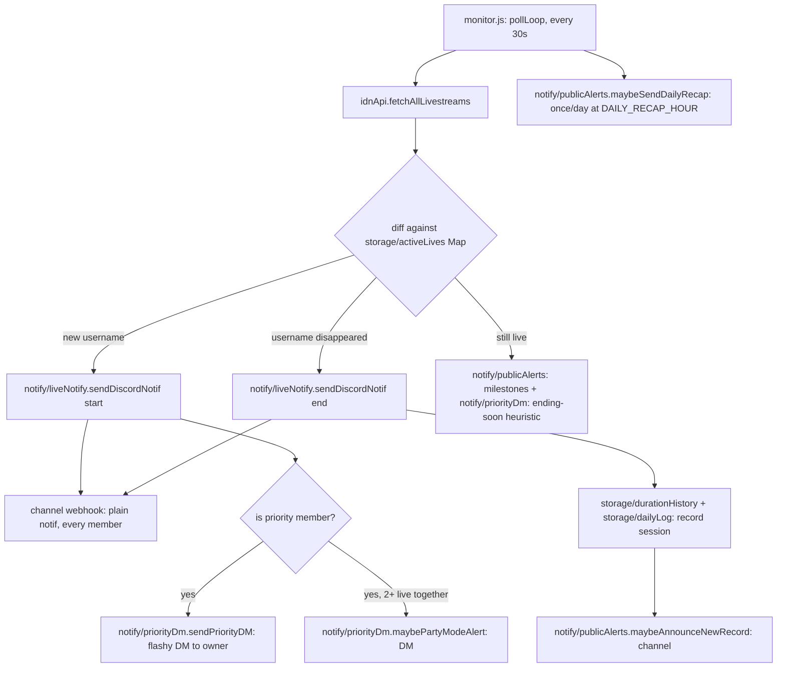

# Architecture

Technical reference for the JKT48 IDN Live Discord notifier. This document assumes no prior context — it should be enough for a new engineer to understand the system, extend it safely, and know where to look when something breaks.

## 1. What this system does

The bot polls IDN Live's public GraphQL API every 30 seconds for livestreams by JKT48 members, and reacts to state changes:

- A member **starts** live → post a notification to a Discord channel (via webhook), optionally with an extra "flashy" DM to the bot owner if that member is on the personal priority list.
- A member **ends** live → post an "ended" notification, record the session's duration/peak-viewer stats.
- Along the way: viewer-count milestones, new personal-duration records, a daily recap, and an optional interactive chat-command bot (`cok ...`) that reads the same data.

It is a single always-on Node.js process (no database — everything is small JSON files), designed to run on Railway with a persistent Volume.

## 2. Directory map

```
scripts/
  cek-top-gifter.js         standalone manual CLI (not part of the 24/7 bot —
                           see §6)
  backup-data.js             pulls a full data backup from the deployed bot
  backfill-live-history.js   one-time: reconstructs pre-2026-09-19 live
                           sessions from Discord's own notification message
                           history, pushes them to the deployed bot (§9)
  set-channel-routing.js     pushes the local username->dedicated-channel-webhook
                           mapping (channel-routing.local.json, gitignored,
                           value optionally { webhookUrl, channelId }) to
                           the deployed bot — see §6's "per-member channels"
src/
  index.js                 entry point — require("./app").start() (this is
                           what "node src/index.js"/npm start actually runs)
  config.js                env loading + validation + all static config
                           (thresholds, priority member definitions, colors)
  app.js                   start(): wires everything together, the only
                           module (besides index.js/config.js) with real side effects
  security.js               HMAC request-signing helpers (used by src/server.js
                           and scripts/cek-top-gifter.js) — a leaf module like
                           config.js/utils.js, no dependency on the rest of src/
  discordClient.js         shared discord.js Client singleton
  idnApi.js                IDN Live GraphQL client
  server.js                HTTP server (health check + signed endpoints)
  monitor.js               the poll loop — orchestrates idnApi + storage + notify
  utils.js                 pure helpers: formatting, WIB time, text matching
  storage/
    jsonStore.js             generic cached JSON-file load/save factory
    activeLives.js            in-memory Map of who's live right now
    durationHistory.js        per-member rolling history of live durations (last 10, for averages)
    liveCount.js               per-member TOTAL live count since the bot started (never pruned)
    dailyLog.js                append-only archive of completed sessions (today/weekly/monthly recap)
    priorityStore.js           raw persistence for custom priority members
    subscriptions.js           per-user "ping me when X goes live" subscriptions
    gifterSnapshot.js          top-gifter snapshots (pushed from scripts/cek-top-gifter.js)
    channelRouting.js           username -> dedicated-channel-webhook mapping
                             (value optionally { webhookUrl, channelId } to also
                             enable §6's "Q3" fallback chat; pushed from
                             scripts/set-channel-routing.js) — §6
  priority/
    index.js                  priority-member domain logic (who's priority,
                             the flashy embed builder, the random thank-you
                             message generator)
  notify/
    webhook.js                shared "POST to the channel webhook" helper
    liveNotify.js              the plain start/end channel notification
    priorityDm.js               owner-only DMs: flashy notif, ending-soon
                             heuristic, Party Mode
    publicAlerts.js             viewer milestones, new records, daily recap
    crashAlert.js                last-resort DM/webhook alert on an uncaught
                             error, sent right before the process exits
  chat/
    router.js                  buildChatReply() dispatcher + Discord event wiring
    replies.js                   pure reply-string builders + recap pagination
    menu.js                       fallback-menu UI + watch-confirm flow
    memberChannelReply.js          simplified 3-button fallback for a dedicated
                                 per-member channel (§6's "Q3")
    pendingState.js                short-lived per-user "waiting for a reply" state
data/                    JSON files (see §4) — local fallback; Railway uses a
                         mounted Volume instead (see §9)
tests/                   automated tests (see §10) — "npm test"
```

## 3. Data flow



The channel webhook (`DISCORD_WEBHOOK_URL`) is the only thing every server member sees. Everything under `notify/priorityDm.js` is a **DM to the owner only** — see §6.

## 4. Data model (`data/*.json`)

All files are cached in memory after first read (`storage/jsonStore.js`) and rewritten in full on every save — there's no database, so treat them as small enough to always fit in memory (they are, by design: duration history keeps only the last 10 entries per member, `daily-log.json` prunes anything older than 35 days).

**"Who's live right now" has exactly one source of truth: `active-lives-cache.json`.** `daily-log.json` only ever stores _completed_ sessions — it never duplicates the "is member X live" question. This wasn't always true: an earlier design tried to track both "open" and "closed" sessions in `daily-log.json` itself, which drifted out of sync with `active-lives-cache.json` twice in practice (see §10's bug notes) before being redesigned this way. Anywhere that needs "today's full picture" (ongoing + finished) merges the two at read time — see `chat/replies.js`'s `getTodaySessionsForRecap()`.

| File                         | Owner module                 | Shape                                                                                                                               | Purpose                                                                                                                                                                                                                                                                                                                                                                                                                                                                                                                                                                                                                                                                                                                                                                                                                                                                                                                                                           |
| ---------------------------- | ---------------------------- | ----------------------------------------------------------------------------------------------------------------------------------- | ----------------------------------------------------------------------------------------------------------------------------------------------------------------------------------------------------------------------------------------------------------------------------------------------------------------------------------------------------------------------------------------------------------------------------------------------------------------------------------------------------------------------------------------------------------------------------------------------------------------------------------------------------------------------------------------------------------------------------------------------------------------------------------------------------------------------------------------------------------------------------------------------------------------------------------------------------------------- |
| `active-lives-cache.json`    | `storage/activeLives.js`     | `{ [username]: { name, slug, liveAt, viewCount, peakViewCount, imageUrl, endingSoonAlerted, alertedMilestones[], missingStreak } }` | Who's live right now — survives restarts so the bot doesn't re-announce a live already in progress. The single source of truth for "is member X live." `missingStreak` (§10's eighteenth bug) counts consecutive poll cycles the member was absent from IDN's response — reset to `0` the moment they're seen again, only crossing `ENDED_GRACE_POLLS` (`monitor.js`) actually ends the session.                                                                                                                                                                                                                                                                                                                                                                                                                                                                                                                                                                  |
| `live-duration-history.json` | `storage/durationHistory.js` | `{ [username]: [{ name, durationMs, at }] }` (max 10 entries)                                                                       | Last-10 completed lives per member. Powers `cok stats`, `cok kapan ... live`, and the ending-soon/new-record heuristics. `at` is the **end** timestamp, not start. Entries are kept sorted by `at` before slicing to 10, since `recordLiveDurationAt` (used by the backfill endpoint) can insert historical entries out of chronological order — `recordLiveDuration` (the normal live-tracking path) always appends the current moment, so this never mattered before backfilling existed.                                                                                                                                                                                                                                                                                                                                                                                                                                                                       |
| `live-count.json`            | `storage/liveCount.js`       | `{ [username]: { name, count, firstLiveAt, lastLiveAt } }`                                                                          | TOTAL completed-live count per member, never pruned/capped (unlike `live-duration-history.json`'s last-10). Powers `cok berapa kali <nama> live`. Incremented once per completed live, alongside `recordLiveDuration`/`recordLiveEnded` in `monitor.js`.                                                                                                                                                                                                                                                                                                                                                                                                                                                                                                                                                                                                                                                                                                          |
| `daily-log.json`             | `storage/dailyLog.js`        | `{ sessions: [{ name, username, startedAtUnix, endedAtUnix, durationMs, peakViewCount }], recapSentDate }`                          | Append-only archive of **completed** sessions only (pruned past 35 days) — written once, when a live ends, via `recordLiveEnded()`. `getCompletedSessionsToday()`/`getCompletedSessionsSince(daysBack)` filter by the WIB date (or a rolling window) of `endedAtUnix`. Powers `cok rekap`/`cok rekap minggu ini`/`cok rekap bulan ini`, `cok paling lama/rame` (today's variant merged with `activeLives` for the still-ongoing half; the weekly/monthly ones are closed historical windows, no merge). This archive only exists in this cross-day form since `16c4b7c` (2026-09-19) — before that, `dailyLog.js` reset `sessions` every WIB midnight, so nothing from before that rewrite can ever appear here. `getEarliestSessionDate()` exposes the archive's oldest record so `replyRecapRange()` can tell the user explicitly when a requested window (7/30 days) isn't fully covered yet, instead of silently showing a short recap that looks like a bug. |
| `custom-priority.json`       | `storage/priorityStore.js`   | `[{ rank, keyword, label, color, sirens }]`                                                                                         | Priority members added via `cok tambah prioritas <nama>`, beyond the 3 hardcoded ones (Nala/Levi/Lily).                                                                                                                                                                                                                                                                                                                                                                                                                                                                                                                                                                                                                                                                                                                                                                                                                                                           |
| `subscriptions.json`         | `storage/subscriptions.js`   | `{ [keyword]: [userId, ...] }`                                                                                                      | Per-user personal reminders (`cok ingetin <nama>`) — any member, any user, independent of the priority list.                                                                                                                                                                                                                                                                                                                                                                                                                                                                                                                                                                                                                                                                                                                                                                                                                                                      |
| `gifter-snapshot.json`       | `storage/gifterSnapshot.js`  | `{ members: { [username]: { name, gifters, checkedAt } } }`                                                                         | Point-in-time top-gifter data, pushed from the local `cek-top-gifter` script (§6) — never fetched by the bot itself.                                                                                                                                                                                                                                                                                                                                                                                                                                                                                                                                                                                                                                                                                                                                                                                                                                              |

## 5. Chat command system (`src/chat/`)

`chat/router.js`'s `buildChatReply(text, {isBotChannel, channelId, authorId})` is the single entry point, called from `messageCreate`. Dispatch order matters:

1. **Pending-state shortcuts first** (checked before the wake-word gate, since none of these require saying "cok"): watch-confirm y/n (`chat/menu.js`), recap-page y/n (`chat/replies.js`), menu-shortcut digits (`chat/pendingState.js`), member-name-prompt follow-ups (`chat/pendingState.js`).
2. **Wake-word gate**: the message must contain "cok", OR be in the configured `BOT_CHANNEL_ID`, OR be in a channel mapped to a specific member via `channelRouting`'s `channelId` (§6's "Q3" — computed once near the top of `buildChatReply` and reused at step 4 too), OR look like a live-related question (contains "live" + a question word/`?`).
3. A long chain of regex/keyword matches against `replies.js` functions, most-specific first (e.g. subscribe commands before the generic priority-list check, since their text overlaps).
4. Falls through to either `chat/memberChannelReply.js`'s member-scoped 3-button fallback (in a dedicated channel) or `chat/menu.js`'s `replyFallbackMenu()` — a numbered menu (buttons + typeable digits) rather than silence.

### The 4 short-lived pending-state maps

All keyed `` `${channelId}:${authorId}` `` (never just `channelId`) with a TTL, so two people talking in the same channel never cross-wire each other's in-progress flow:

| Map                   | Lives in               | Set when                                           | Consumed by                                                                                                                                                                       |
| --------------------- | ---------------------- | -------------------------------------------------- | --------------------------------------------------------------------------------------------------------------------------------------------------------------------------------- |
| `pendingWatchConfirm` | `chat/menu.js`         | User picks a live member (menu #4 or `"4 <nama>"`) | y/n → "gas nonton" or a status update                                                                                                                                             |
| `pendingRecapPage`    | `chat/replies.js`      | A recap table has more pages                       | y/n → next page (also carries `rangeDays` — `null` for today, `7`/`30` for weekly/monthly — so paginating a weekly recap doesn't silently switch to today's) or "oke, segitu aja" |
| `pendingMenuByAuthor` | `chat/pendingState.js` | Fallback menu was just shown                       | Bare digit 1-9                                                                                                                                                                    |
| `pendingMemberPrompt` | `chat/pendingState.js` | Menu #4/#9 picked with no name yet                 | Next message = the member name                                                                                                                                                    |

(This replaced an earlier per-channel-only key, which caused a second person's identical digit reply in a shared channel to be misrouted back to the menu instead of resolved — see git history around commit `aca7035`.)

**Recap navigation also has a button path that bypasses `pendingRecapPage` entirely** (§10's twenty-first item): every recap table (`buildRecapPageBlock`) attaches a row of buttons — "Maju"/"Mundur" (whichever direction actually exists on that page), "Tutup rekap" (always), and "🔍 Cari member" (always) — whose `customId` is self-contained (`recap_nav:<next|prev>:<range>:<page>`, or the parameterless `recap_nav:close`/`recap_nav:search:<range>`), so a button on an old message stays clickable indefinitely with no TTL, unlike the typed "y"/"mundur" path above which still goes through `pendingRecapPage` and still expires after `PENDING_RECAP_PAGE_TTL_MS`. Both paths remain fully supported side by side and render through the same `buildRecapPageBlock()`, which also refreshes `pendingRecapPage` for that channel+author either way, so mixing typed and clicked navigation stays consistent — but they differ in delivery: the typed path still posts a new message (`message.reply()` in `chat/router.js`), while "next"/"prev"/"close" use `interaction.update()` to **edit the existing message the buttons are attached to** in place, rather than `interaction.reply()`, which would post a new one (§10's twenty-third item — the original button implementation used `reply()` too, spamming a new table message into the channel per click until the owner flagged it). "close" specifically updates the message to the fixed thank-you text with `components: []`, clearing the button row so the closed table can't be clicked again. "🔍 Cari member" opens a `ModalBuilder` text-input prompt (`recap_search_modal:<range>`) rather than a dropdown — chosen over a `StringSelectMenuBuilder` because the member list this feature is meant to scale to (~40+) exceeds Discord's 25-option select limit, where a genuine text search does not; its handler (`handleRecapSearchModalSubmit`) filters that range's sessions by given-name fragment and shows an un-paginated result table, deliberately simpler than the full recap flow since one member's sessions rarely span more than a page. That search reply also asks "Rekap sebelumnya masih mau ditampilin?" with "Ya, biarin"/"Enggak, hapus aja" buttons (§10's twenty-fourth item) — since the original table message is still sitting above the search result otherwise — whenever `interaction.message` was available on the modal submission (it's only populated when the modal was opened from a button on an existing message, which is always true for this flow's own "🔍 Cari member" button, but is defensively checked rather than assumed).

## 6. Per-member notification routing (priority DMs + dedicated channels)

Nala/Levi/Lily (plus anything added via `cok tambah prioritas`) are the bot **owner's** personal favorites, not a server-wide setting. Since a webhook posts one identical message to everyone in the channel, there's no way to make the channel itself look different per viewer — so as of this session, the flashy treatment (embed, color, link button) moved entirely to DMs:

- **Channel** (`notify/liveNotify.js`): every member, priority or not, gets the same plain-content start/end notification — no title, no color, no buttons. A priority member can optionally get a couple of extra words woven into that same plain text via `startIntro`/`startHashtag` on their `PRIORITY_MEMBERS` entry (currently only Nala: an intro line before the message and `#NaLex` after — see `buildNormalPayload`'s `priority` param), but the message _structure_ never changes. `buildNormalPayload` also attaches the IDN thumbnail (`image_url`, same field the priority DM embed uses) as `embeds: [{ image: { url } }]` on a "start" notification when IDN provides one — no title/color/fields on that embed either, so it stays visually distinct from the priority DM's fuller embed while still being more eye-catching than plain text. Every notification also ends `content` with a `Mulai jam HH.MM.SS WIB` (start) or `Selesai jam HH.MM.SS WIB` (end) line (§10's twenty-second item) — the start time comes from IDN's own `live_at` (passed all the way from `monitor.js` through `sendDiscordNotif`'s `liveAt` param), not from when the bot happened to poll it, so it stays accurate even though polling only happens every 30 seconds; the end time is always "now" (the instant the bot detected the member as gone), since IDN doesn't report a real end timestamp. This is always appended as the LAST line specifically so `scripts/backfill-live-history.js`'s `START_RE`/`END_RE` (which only anchor the start of the string, not the end) keep matching old and new messages alike without needing an update. None of this touches the rest of `content`: `activeLives`/`daily-log.json` (what the recap reads) are recorded from the bot's own start/end bookkeeping, never parsed back out of the channel message text — so extra flavor text or an image embed is safe to add without risking a repeat of §10's format-change parsing bugs.
- **Owner DM** (`notify/priorityDm.js`, requires `DISCORD_BOT_TOKEN` + `PRIORITY_PING_USER_ID`): the flashy embed (colors, link button, Nala's randomized thank-you message), the "ending soon" duration heuristic, and "Party Mode" (2+ priority members live together) — all sent via `client.users.fetch(id).send(...)`, a private 1:1 DM channel nothing else in the server can read. Same start/end time is shown here too, as a dedicated `🕐 Mulai`/`🕐 Selesai` embed field (`buildPriorityPayload`'s `timestamp` option) — deliberately NOT folded into `embeds[0].description`, since `scripts/backfill-live-history.js`'s `parsePriorityEmbedEvent` reads that field verbatim as the member's name for "end" events.

### Per-member dedicated channels ("Q2")

Separate concern from priority members above — **any** member (not just Nala/Levi/Lily) can have their own dedicated channel (e.g. `#aralie-jkt48`), and this is orthogonal to priority status entirely. `sendDiscordNotif` (`notify/liveNotify.js`) sends the exact same start/end `payload` to **two** destinations when a mapping exists: the shared/default webhook (`DISCORD_WEBHOOK_URL`, unchanged from before) and, concurrently (`Promise.all`, not sequential — avoids doubling per-member latency in `monitor.js`'s per-member poll loop), the member's dedicated webhook from `storage/channelRouting.js`. This is **duplication**, not replacement — the shared channel keeps getting every member's notification regardless of whether they also have a dedicated one. Only the shared webhook's result determines `terkirim` (and therefore `activeLives` bookkeeping) — the dedicated send is best-effort, exactly like `sendPriorityDM`'s failure handling: a deleted/broken dedicated webhook logs an error but never blocks the shared notification or poll cycle. Scope is deliberately start/end live notifications only for now — milestone/record alerts and the daily recap stay shared-channel-only.

`storage/channelRouting.js` keys its map by the member's **exact IDN username** (e.g. `"jkt48_aralie"`), not a fuzzy keyword like `priorityStore.js`/`subscriptions.js` use — at the ~40+-member scale this feature is meant to scale to, an exact key sidesteps a whole-word-collision risk that was negligible at priority's 3-6-entry scale but becomes real at that size, and it's a simpler O(1) lookup besides. Keys are lowercased on save (`saveChannelRouting`) and the lookup also lowercases its input (`getChannelWebhookFor`) — same defensive posture as `idnApi.js`'s `isJkt48Member`, which already doesn't trust IDN's `creator.username` casing to be consistent. Found in practice: the owner's own local `channel-routing.local.json` had `"jkt48_Aralie"` (capitalized), which would have silently never matched the actual lowercase username IDN reports — no error, the dedicated-channel send would just never fire.

Managed via a **local file + signed push script**, not a chat command like `cok tambah prioritas` — deliberately, because a webhook URL is a bearer secret (whoever has it can post into that channel), and typing/pasting 40+ of them into Discord chat would leave them sitting in that channel's message history forever. `scripts/set-channel-routing.js` reads a local `channel-routing.local.json` (gitignored, same treatment as `.env`; `channel-routing.local.json.example` shows the shape) and signs+POSTs the whole map to `/api/channel-routing` (`server.js`'s `handleChannelRoutingUpload`, wired through the same `signedEndpoint()`/`requireSignedRequest` protection as `/api/backup` and `/api/gifter-snapshot`) — same `BOT_API_URL`/`API_SECRET` env vars already used by `cek-top-gifter.js`/`backup-data.js`. Every push is a **full replace**, never a merge: the pushed file is always treated as the complete, current list, so removing a member's channel is just deleting its line locally and re-running the script. Both the script and the server endpoint validate each value against Discord's webhook URL shape before accepting it (`discord.com` **or** the older-but-still-functional `discordapp.com` domain — a real webhook URL using the old domain was initially rejected by mistake, caught when the owner tried pushing one), so a typo/wrong-paste is caught immediately (400, listing which username's entry was bad) instead of silently failing on every future notification attempt for that member. `handleBackupExport`/`scripts/backup-data.js` include this mapping too, consistent with backup's "aggregate of every storage module" contract.

`scripts/backfill-live-history.js` intentionally stays scoped to the one shared channel only — dedicated channels are new, going forward, with no prior history to reconstruct.

If `DISCORD_BOT_TOKEN` is unset, none of this fires — the bot logs that at boot and priority members just get the plain channel notification like anyone else. If it's set but `PRIORITY_PING_USER_ID` is empty, the same degradation happens (logged separately in `chat/router.js`'s `clientReady` handler, specifically so this is checkable from Railway's Deploy Logs alone without needing dashboard access).

### Per-member channel fallback chat ("Q3")

Built on top of Q2, opt-in per member: a dedicated channel can also get a simplified 3-button fallback reply when someone chats in it and nothing else in `buildChatReply`'s dispatch chain matches. This required the routing entry to know the channel's own Discord ID, not just its webhook — so `channelRouting.js`'s value grew a second shape: either the original plain webhook-URL string (notification duplication only, no fallback chat — still fully supported, nothing breaks for members already set up this way) or `{ webhookUrl, channelId }` (notification duplication **and** the fallback chat below). `channelId` is filled in by hand from Discord's "Copy Channel ID" (Developer Mode), deliberately not resolved automatically from the webhook via an extra Discord API call — the owner already copies IDs by hand for `BOT_CHANNEL_ID`/`PRIORITY_PING_USER_ID` in `.env`, so this reuses a workflow that already exists instead of adding a runtime dependency and a cache-invalidation problem for something that changes rarely.

`storage/channelRouting.js`'s `getUsernameForChannel(channelId)` is the reverse lookup this enables — given an incoming message's `channel.id`, find which member (if any) that channel is dedicated to. It's a linear scan over the routing map (not a cached reverse index): at the ~40-entries scale this feature targets, that's cheap, and it avoids keeping a second data structure in sync every time the mapping is re-pushed. Only object-shaped entries with a `channelId` can match — a legacy plain-string entry never does, since the bot genuinely doesn't know which channel it corresponds to.

`chat/router.js`'s `buildChatReply` calls this lookup once near the top (not just at the fallback) and reuses the result twice: it's OR'd into `mentionsBot` alongside `isBotChannel`, so a dedicated channel bypasses the "cok"/live-question wake-word gate exactly like `BOT_CHANNEL_ID` does — almost any message in it is treated as addressed to the bot. (This was originally left gated the same as any ordinary channel; the owner reported the bot looking completely unresponsive in a dedicated channel, which turned out to be a plain message with no "cok"/live-sounding phrasing silently returning `null` at the wake-word check before ever reaching the dedicated-channel branch below.) Then, as the very last step of the dispatch chain — after every named command/pattern has already failed to match, exactly where it previously fell straight through to `menu.js`'s 9-option `replyFallbackMenu()` — the same lookup decides the fallback itself: if the channel is dedicated to a member, `chat/memberChannelReply.js`'s `replyMemberChannelFallback(username)` is returned instead, 3 buttons ("Udah live hari ini?", "Udah berapa kali live?", "Lagi live sekarang?") scoped to that one member, rather than the generic menu that would otherwise ask "which member?" (options 4/9) — a question this channel's whole existence already answers.

Each of the 3 buttons resolves independently (`customId` shape `member_fallback:<action>:<username>`, dispatched by `handleMemberChannelFallbackButton`): "today" and "status" answer directly from `activeLives`/`dailyLog.js`'s today-sessions; "status" additionally offers a Yes/No button pair ("mau nonton?") when the member is live right now, re-checking `activeLives` at click time (not trusting the state from when the button was first shown) before handing out the watch link — same staleness-safety pattern as `menu.js`'s existing `tryHandleWatchConfirmShortcut`. "count" reads the never-pruned total from `storage/liveCount.js` and, if there's any history at all, offers its own Yes/No pair ("mau liat history live-nya?") that on "yes" renders a table via `replies.js`'s `buildRecapTablePage` (first page only, no further pagination — deliberately simpler than "cok rekap"'s multi-page flow) filtered to that one member's sessions from `dailyLog.js` (so it can come up empty despite a nonzero total count, if all of that member's individual sessions have aged out of the 35-day retention window; the reply says so explicitly rather than looking broken). Both "no" branches ("nggak usah live history" / "nggak nonton") answer with the same fixed "terima kasih, enjoy" text.

Display name resolution (`resolveMemberDisplayName` in `memberChannelReply.js`) prefers `activeLives` (if currently live) then `storage/liveCount.js`'s last-known name, falling back to the raw IDN username if neither has ever been recorded for that member — this only shows up for a member added to the routing file who has never actually gone live since the bot started tracking them.

Validation of the new `{ webhookUrl, channelId }` shape lives in two places, same pattern as Q2's webhook-URL check: `scripts/set-channel-routing.js` (client-side, so a typo is caught on the owner's own machine) and `server.js`'s `handleChannelRoutingUpload` (server-side, the actual gate — `channelId` must match a Discord snowflake shape, `/^\d{17,20}$/`; this only rejects obviously-wrong values like an empty string or non-numeric text, it does not verify the channel actually exists, which would need a live Discord API call).

`scripts/cek-top-gifter.js` also needs `BOT_API_URL` + `API_SECRET` (see §9) but is a **separate, manually-run** local tool — it is never part of the always-on bot process, since fetching top-gifter data requires a personal IDN login that must never live on a 24/7 server.

## 7. Extension points

- **New chat command**: add a `reply*` function to `chat/replies.js`, then a matcher in `chat/router.js`'s `buildChatReply` chain (order matters — put more specific patterns before broader ones). Add a line to `replyHelp()`.
- **New priority member**: no code change needed — `cok tambah prioritas <nama>` (owner only). To change the 3 hardcoded ones' behavior, edit `PRIORITY_MEMBERS` in `config.js`.
- **New storage domain**: add a file under `storage/`, call `createJsonStore(filePath, defaultValue, { errorLabel })` from `storage/jsonStore.js`, wrap with domain-specific functions. Always pair a `load()` with a `save()` after mutating — the cache assumes nothing mutates without saving.
- **New notification type**: decide first whether it belongs in the shared channel (`notify/liveNotify.js` / `notify/publicAlerts.js`, visible to everyone) or the owner's DM (`notify/priorityDm.js`, visible to nobody else) — see §6 for why that distinction matters.

## 8. Environment variables

| Variable                          | Required            | Default                                   | Effect                                                                                                                                                                                                                                                                                                   |
| --------------------------------- | ------------------- | ----------------------------------------- | -------------------------------------------------------------------------------------------------------------------------------------------------------------------------------------------------------------------------------------------------------------------------------------------------------- |
| `DISCORD_WEBHOOK_URL`             | **yes**             | —                                         | Bot exits at boot if missing. Channel notifications.                                                                                                                                                                                                                                                     |
| `POLL_INTERVAL_SECONDS`           | no                  | `20`                                      | How often (seconds) `monitor.js` polls IDN for live changes. Lower = faster detection, more IDN API load.                                                                                                                                                                                                |
| `DISCORD_BOT_TOKEN`               | no                  | —                                         | Enables chat commands + priority owner DMs.                                                                                                                                                                                                                                                              |
| `PRIORITY_PING_USER_ID`           | no                  | —                                         | Discord user ID that gets priority DMs and owns admin commands (`tambah/hapus prioritas`).                                                                                                                                                                                                               |
| `API_SECRET`                      | no                  | —                                         | HMAC secret for `/api/status`, `/api/gifter-snapshot`, `/api/backup`, and `/api/channel-routing`; those endpoints 503 without it.                                                                                                                                                                        |
| `CACHE_DIR`                       | no                  | `RAILWAY_VOLUME_MOUNT_PATH`, else `data/` | Where all JSON files live.                                                                                                                                                                                                                                                                               |
| `RAILWAY_VOLUME_MOUNT_PATH`       | no (set by Railway) | —                                         | Persists data across redeploys when a Volume is attached.                                                                                                                                                                                                                                                |
| `BOT_CHANNEL_ID`                  | no                  | —                                         | Channel where the bot replies without needing "cok"/"live".                                                                                                                                                                                                                                              |
| `ENDING_SOON_THRESHOLD_MINUTES`   | no                  | `40`                                      | Fallback threshold (minutes) for the ending-soon DM heuristic when a member has no duration history yet.                                                                                                                                                                                                 |
| `DAILY_RECAP_HOUR`                | no                  | `23`                                      | WIB hour the automatic daily recap fires.                                                                                                                                                                                                                                                                |
| `PORT`                            | no                  | `3000`                                    | HTTP health-check server port.                                                                                                                                                                                                                                                                           |
| `BOT_API_URL`, `API_SECRET`       | no                  | —                                         | `scripts/cek-top-gifter.js` (push gifter snapshots), `scripts/backup-data.js` (pull a data backup), `scripts/backfill-live-history.js` (push reconstructed historical sessions), and `scripts/set-channel-routing.js` (push the per-member dedicated-channel mapping) — same two env vars, same bot URL. |
| `IDN_AUTH_TOKEN`, `IDN_X_API_KEY` | no                  | prompts interactively                     | `scripts/cek-top-gifter.js` only — personal IDN credentials, never touches the 24/7 bot.                                                                                                                                                                                                                 |

## 9. Deployment (Railway)

- `package.json`'s `main`/`scripts.start` point at `src/index.js` (a thin `require("./app").start()`), run via `npm start` — no separate `js/` entry point exists anymore, everything lives under `src/`.
- Attach a Railway **Volume** and Railway auto-populates `RAILWAY_VOLUME_MOUNT_PATH`; `config.js` picks it up automatically (no code change needed) so `data/*.json` survives redeploys instead of resetting.
- `config.js` logs which `CACHE_DIR` is actually active at boot — check Railway's Deploy Logs first if stats/history seem to have reset unexpectedly.
- The HTTP server (`src/server.js`) exists purely so Railway's health check sees an open port; the bot itself is a background poller, not a web service.
- **Graceful shutdown**: `src/app.js`'s `start()` registers `SIGTERM`/`SIGINT` handlers — on redeploy/restart, Railway sends `SIGTERM` and waits before force-killing. The handler stops `monitor.js`'s poll loop (`stopPolling()` — lets an in-flight cycle finish, just skips scheduling the next one), destroys the Discord client, and closes the HTTP server, with a 5-second fallback `process.exit(0)` in case something hangs. Look for `"SIGTERM diterima, matiin bot dengan rapi..."` in Deploy Logs right before a redeploy's old instance stops.
- **Crash alerts**: `start()` also registers `uncaughtException`/`unhandledRejection` handlers that call `notify/crashAlert.js`'s `sendCrashAlert()` (DM to the owner if `DISCORD_BOT_TOKEN`/`PRIORITY_PING_USER_ID` are set, else the public webhook channel) before exiting — a last-resort net for something that escapes `checkLiveMembers()`'s own per-cycle try/catch, so a real crash doesn't go silently unnoticed until you happen to check Deploy Logs.
- **Data backup**: a Railway Volume survives redeploys, but it's still the _only_ copy of the bot's data — there's no automatic off-Railway backup. `npm run backup-data` (`scripts/backup-data.js`, same manual-CLI category as `cek-top-gifter.js` — not part of the 24/7 bot) pulls everything from a new signed `GET /api/backup` endpoint (`src/server.js`'s `handleBackupExport` — read-only, aggregates every storage module's current `load()`) and writes it to a timestamped file under `backups/` (gitignored, same reasoning as `data/`). Run it manually whenever you want a snapshot; nothing calls it automatically.
- **Historical backfill**: local scripts can't write directly to a Volume mounted on Railway, so `scripts/backfill-live-history.js` follows the same push pattern as `cek-top-gifter.js` instead of touching files locally — it reads the bot's own notification-channel message history via `DISCORD_BOT_TOKEN` (the channel webhook messages are the only surviving record of live sessions from before `daily-log.json` became a real archive, see §10), **plus, if `PRIORITY_PING_USER_ID` is set, the bot's own DM thread with the owner** (priority-member "JANGAN SAMPE KETINGGALAN!" notifications moved there entirely after 2026-09-18, see §10's eighth bug entry — that history exists nowhere else), reconstructs start/end pairs locally from both sources combined, then `POST`s them to a signed `POST /api/backfill-live-history` (`src/server.js`'s `handleBackfillLiveHistory`) which does the actual writing on the Railway side. Defaults to a dry run (preview only, now also logging each reconstructed session's name/start/end/duration, not just a total count); `npm run backfill-live-history -- --apply` commits. Safe to re-run **as many times as needed** — each session is deduped individually against what's already in `daily-log.json` (same username, `endedAtUnix` within a small tolerance — see §10's twelfth bug for why this replaced an earlier date-cutoff approach that broke under repeated runs), so a repeat run can't double-insert a session it already recorded, but also won't wrongly reject a genuinely new session just because it falls in a period some other session already covered. The accepted sessions are written to **both** `daily-log.json` (via `recordLiveEnded`) **and** `live-duration-history.json` (via `recordLiveDurationAt`, with the session's real historical end time — see §10's fifth bug entry for why the first version of this endpoint missed the second file) — `live-count.json` alone is rebuilt from every valid session received, not just the newly-accepted ones, since it covers the whole timeline by design (see the code comment in `rebuildLiveCountFromSessions`).
- **Repairing already-corrupted history**: if `backfill-live-history.js --apply` was run before the ninth-bug fix (§10) existed, the bad implausible-duration sessions it wrote are still sitting in Railway's Volume — fixing the reconstruction logic only stops _new_ corruption, it doesn't retroactively clean what's already there. `npm run repair-live-history -- --apply` (`scripts/repair-live-history.js`, same manual-CLI/dry-run-by-default pattern, needs only `BOT_API_URL`/`API_SECRET`) calls a signed `POST /api/repair-live-history` (`handleRepairLiveHistory`) that strips any `daily-log.json`/`live-duration-history.json` entry whose duration exceeds `MAX_PLAUSIBLE_LIVE_DURATION_MS`, then rebuilds `live-count.json` from what's left. Safe to run more than once — a second run reports 0 removed once the corrupted entries are gone.

### Troubleshooting: dashboard stuck showing "Building"

Railway's deploy badge can keep showing **"Building"** even after the **Build Logs** tab clearly finished (look for a green checkmark on `exporting to docker image format` and `image push` near the bottom — if those are there, the image itself built fine). This is almost always one of two things, in order of likelihood:

1. **The dashboard just hasn't refreshed.** Build finished, deploy is already progressing (or done), the badge is stale. Reload the page.
2. **The container is crashing right after start**, which Railway can sometimes still render as a lingering "Building" state before it flips to "Failed" or starts crash-looping. To tell the difference from (1):
   - Open the **Deploy Logs** tab (next to Build Logs) — that's where the actual `node src/index.js` process's output goes, not Build Logs.
   - Look for the boot sequence: `CACHE_DIR aktif: ...`, then `Bot notifikasi IDN Live jalan...`, and (if `DISCORD_BOT_TOKEN` is set) `Bot tanya-jawab login sebagai ...`. If all of these show up, the bot is actually running fine and the dashboard badge was just stale (case 1).
   - If Deploy Logs instead show a stack trace / `Error: Cannot find module ...` / the process exiting immediately, that's a real crash — paste that log, not the Build Logs, for diagnosis.

Things already verified as **not** the cause of this (so don't re-check them from scratch next time this happens, unless the codebase changes again in a way that could reintroduce them):

- Case-sensitivity of every `require()` path vs. the actual on-disk filename (Windows-dev/Linux-prod mismatches silently pass locally but crash on Railway) — audited with a small Node script that walks every `.js` file, resolves each relative `require()`, and compares it case-sensitively against `fs.readdirSync()` output.
- `package.json`'s `main`/`scripts.start` pointing at a real, existing file (`src/index.js`).
- No `Dockerfile`/`nixpacks.toml`/`railway.json`/`Procfile` overriding the start command — `package.json` is the only place it's declared.

## 10. Testing

`npm test` runs `node --test` (Node's built-in test runner — zero new dependencies, matches the project's existing "no framework unless it earns its weight" approach). Test files live under `tests/*.test.js`.

**CI**: `.github/workflows/test.yml` runs `npm test` on every push and pull request. **This gives visibility, not a deploy gate** — this repo's workflow is direct pushes to `master` with no branch protection or PR step, and Railway's deploy trigger isn't gated on GitHub Actions status by default. A failing test shows up as a red X on the commit on GitHub, but it does **not** by itself stop that commit from being deployed to Railway. Making it an actual gate would mean adding branch protection + a PR-based workflow, or a Railway-side check — neither is set up, since it'd change how this project is worked on day to day.

**Lint & format**: `npm run lint` (ESLint, flat config in `eslint.config.js`) catches real bugs (unused vars, undefined references, etc.) — `no-console` is deliberately off, since `console.log`/`console.error` to Railway's log stream is this codebase's entire logging strategy, not a leftover debug statement. `npm run format`/`format:check` (Prettier, `.prettierrc`) handles pure style, configured to match the codebase's existing conventions (double quotes, semicolons, a wide 150-char `printWidth` so the many long explanatory comments don't get hard-wrapped). Neither is wired into CI yet — they're available as local tools, run manually before a commit.

**Coverage is deliberately targeted, not exhaustive** — it covers the pure logic and storage behavior that's already proven fragile in practice (things this project has actually gotten wrong before), not every function in the codebase:

| File                                | What it covers                                                                                                                                                                                                                                                                                                                                                                                                                                                                                                                                                                                                                                                                                                                                                                                                                                                                                                                                                                                                                                                                                                                                                                                                                                                                                                                                                                                                                                                                                                                                                                                                                                                                                                                                                                                                                                                                                                                                       |
| ----------------------------------- | ---------------------------------------------------------------------------------------------------------------------------------------------------------------------------------------------------------------------------------------------------------------------------------------------------------------------------------------------------------------------------------------------------------------------------------------------------------------------------------------------------------------------------------------------------------------------------------------------------------------------------------------------------------------------------------------------------------------------------------------------------------------------------------------------------------------------------------------------------------------------------------------------------------------------------------------------------------------------------------------------------------------------------------------------------------------------------------------------------------------------------------------------------------------------------------------------------------------------------------------------------------------------------------------------------------------------------------------------------------------------------------------------------------------------------------------------------------------------------------------------------------------------------------------------------------------------------------------------------------------------------------------------------------------------------------------------------------------------------------------------------------------------------------------------------------------------------------------------------------------------------------------------------------------------------------------------------- |
| `tests/utils.test.js`               | Pure formatting/text/WIB-time helpers, plus `safeReplyOptions` always attaching `allowedMentions: { parse: [] }` regardless of whether the reply it wraps is a string or an object (§10's sixteenth bug).                                                                                                                                                                                                                                                                                                                                                                                                                                                                                                                                                                                                                                                                                                                                                                                                                                                                                                                                                                                                                                                                                                                                                                                                                                                                                                                                                                                                                                                                                                                                                                                                                                                                                                                                            |
| `tests/jsonStore.test.js`           | The generic cache/load/save factory: default fallback, corrupt-file recovery, mkdir-on-save, persistence across a fresh instance (simulating a restart), and that a failed disk write (mocked `fs.writeFileSync`) does NOT desync the in-memory cache from what's actually on disk (§10's thirteenth bug).                                                                                                                                                                                                                                                                                                                                                                                                                                                                                                                                                                                                                                                                                                                                                                                                                                                                                                                                                                                                                                                                                                                                                                                                                                                                                                                                                                                                                                                                                                                                                                                                                                           |
| `tests/dailyLog.test.js`            | `recordLiveEnded` appending completed sessions correctly, `getCompletedSessionsToday`'s date filtering (including the cross-midnight case), `getCompletedSessionsSince`'s rolling-window filtering, `getEarliestSessionDate`, the legacy-shape migration filter, and the 35-day retention pruning.                                                                                                                                                                                                                                                                                                                                                                                                                                                                                                                                                                                                                                                                                                                                                                                                                                                                                                                                                                                                                                                                                                                                                                                                                                                                                                                                                                                                                                                                                                                                                                                                                                                   |
| `tests/liveCount.test.js`           | `recordLiveCompleted`'s per-username counting (increments correctly, `firstLiveAt` never changes after the first record, `lastLiveAt`/`name` update on later ones, members don't cross-contaminate each other's counts), `findLiveCountByNameFragment`'s fuzzy lookup, and `getLiveCountLeaderboard`'s count-descending ordering + `limit` truncation + empty-state.                                                                                                                                                                                                                                                                                                                                                                                                                                                                                                                                                                                                                                                                                                                                                                                                                                                                                                                                                                                                                                                                                                                                                                                                                                                                                                                                                                                                                                                                                                                                                                                 |
| `tests/channelRouting.test.js`      | `loadChannelRouting`/`saveChannelRouting`'s full-replace-not-merge semantics, `getChannelWebhookFor`'s exact-username lookup — including that a username which merely starts with/contains a mapped one (e.g. `jkt48_intannia` vs. a mapped `jkt48_intan`) is deliberately NOT matched, unlike priority/subscriptions' fuzzy keyword matching, that both saving and looking up are case-insensitive, and that `getChannelWebhookFor` still resolves the object-shaped `{ webhookUrl, channelId }` entry correctly (§6); plus `getUsernameForChannel`'s reverse lookup (§6's "Q3") — an object entry's `channelId` resolves back to its username, an unmapped/empty/`null` channel ID returns `null`, and a legacy plain-string entry (no `channelId` at all) never matches even by its own webhook URL text.                                                                                                                                                                                                                                                                                                                                                                                                                                                                                                                                                                                                                                                                                                                                                                                                                                                                                                                                                                                                                                                                                                                                         |
| `tests/priority.test.js`            | Custom priority add/remove validation, and `buildPriorityPayload`'s mention/end-message/start-intro-hashtag behavior, plus its `🕐 Mulai`/`🕐 Selesai` time field (always present regardless of `endMessagePool`, built from the `timestamp` option, defaults to "now" when omitted, and never leaks into `embeds[0].description` — see §6).                                                                                                                                                                                                                                                                                                                                                                                                                                                                                                                                                                                                                                                                                                                                                                                                                                                                                                                                                                                                                                                                                                                                                                                                                                                                                                                                                                                                                                                                                                                                                                                                         |
| `tests/liveNotify.test.js`          | `buildNormalPayload` stays plain-content (no title/color/fields) for every status/member, that a priority member's `startIntro`/`startHashtag` (Nala) get woven into that same plain text while a member without those fields (Levi/Lily/anyone else) is untouched, that the IDN thumbnail (`imageUrl`) becomes `embeds: [{ image }]` on a "start" notification when present, is absent when `imageUrl` is `null`, and is never attached on an "end" notification, and that `content` always ends with a `Mulai jam`/`Selesai jam` WIB-clock line built from the `timestamp` param (defaulting to "now" when omitted); plus `sendDiscordNotif` (real function, `global.fetch` mocked) handling a garbage/unparseable `liveAt` and a `null` `liveAt` without throwing, falling back to "now" for the `Mulai jam` line in both cases (§10's nineteenth bug); and the per-member dedicated-channel dual-send (§6) — a member with a `channelRouting` mapping gets exactly two webhook POSTs with identical payloads (default channel + dedicated one), a member without one gets exactly one (unchanged old behavior), and the dedicated-channel POST failing does NOT flip the overall result to `false` (mirrors `sendPriorityDM`'s existing non-fatal-failure invariant).                                                                                                                                                                                                                                                                                                                                                                                                                                                                                                                                                                                                                                                                            |
| `tests/replies.test.js`             | `buildRecapTablePage` — sorting, pagination, and the cross-midnight "(DD/MM)" date marker — plus `getTodaySessionsForRecap`'s merge, `replyRecapRange`'s aggregation (and that it does _not_ merge `activeLives`, unlike the today variant) plus its "archive not fully covered yet" note, `tryHandleRecapPageShortcut`'s forward/backward page navigation (including rejecting "y" past the last page and "mundur" before the first, and that "n" still cancels outright — §10's eleventh bug), `replyLiveCount`, `replyLiveCountLeaderboard`'s count-descending ordering (relative-order assertions only, since this file accumulates `live-count.json` state across its own tests), `replyMemberStats`/`replySchedulePattern`'s bucket/weekday logic, `replyPriorityList`, subscribe/unsubscribe, the owner-gated priority add/remove, `replySpecificMember` rendering a normal `liveAt` correctly plus not throwing (and omitting the "mulai jam" clause) on a garbage or `null` `liveAt` (§10's nineteenth bug), `replyHelp` including the notification-settings tip (§10's twentieth item); and `handleRecapNavButton`/`handleRecapSearchModalSubmit`, the recap pagination buttons and member-search modal, including the in-place edit-vs-new-message behavior and the post-search keep/delete prompt (§10's twenty-first, twenty-third, and twenty-fourth items — see those entries for the detailed case lists).                                                                                                                                                                                                                                                                                                                                                                                                                                                                                                                           |
| `tests/router.test.js`              | `buildChatReply`'s dispatch chain — the wake-word gate, the explicitly order-sensitive regex pairs ("reminder" before "ingetin", "berhenti ingetin" before "ingetin", "rekap minggu/bulan" before plain "rekap", "paling sering/paling banyak/tersering/terbanyak" + "live" before plain "siapa yang live"), one case per major command branch, both directions of `"berapa kali <nama> live"` (keyword-first and name-first, including the "cok" wake-word-not-swallowed-into-the-name regression), the fallback-menu path, and (§6's "Q3") that an unmatched message in a channel mapped via `channelRouting`'s `channelId` gets `memberChannelReply.js`'s 3-button per-member fallback instead of the generic 9-option menu, while an unmapped channel is unaffected and still gets the generic menu. Deliberately skips anything that dispatches to `replyTodayRecapSoFar` (menu option 8 / "cok rekap"), since that makes a real network call to the external archive — see `tests/menu.test.js`'s note; `replyRecapRange` has no such network call, so the weekly/monthly recap dispatch tests exercise the real function.                                                                                                                                                                                                                                                                                                                                                                                                                                                                                                                                                                                                                                                                                                                                                                                                                     |
| `tests/menu.test.js`                | `resolveBareMenuChoice`'s dispatch table, the watch-confirm y/n flow (including re-checking live status at confirm time, and a non-y/n answer not consuming the pending state), and the button/select-menu handlers via lightweight fake `interaction` objects (`{ customId, channelId, user: { id }, values, reply }` — the code never touches anything else on a real discord.js interaction, so no mocking library is needed). Asserts every captured `interaction.reply()` call arrives as `{content, ..., allowedMentions: { parse: [] }}` (§10's sixteenth bug), never a bare string.                                                                                                                                                                                                                                                                                                                                                                                                                                                                                                                                                                                                                                                                                                                                                                                                                                                                                                                                                                                                                                                                                                                                                                                                                                                                                                                                                          |
| `tests/monitor.test.js`             | `stopPolling()` is safe to call before any poll cycle has run, and idempotent. Deliberately doesn't exercise `pollLoop()` itself — it calls the real IDN API. Does exercise `checkLiveMembers()` directly, across multiple consecutive calls, with `global.fetch` mocked (no real network): the implausible-duration guard (§10's fifteenth bug) — IDN reports nobody live and a manually seeded stale `activeLives` entry is forced through the "just ended" path, confirming an implausible (>12h) duration is discarded from the daily log while a plausible one still gets recorded normally; the missing-poll grace period (§10's eighteenth bug) — a mock that simulates IDN's own paginated response shape across a queue of per-cycle "who's live" snapshots confirms a single miss is tolerated (session stays open under its original `liveAt`, `missingStreak` resets once seen again) while two consecutive misses still correctly end and record the session; and, end-to-end through `checkLiveMembers()` itself (captured outgoing webhook bodies, not just a direct `buildNormalPayload()` call), that the "start" notification's `Mulai jam` line reflects IDN's own `live_at` (not the poll time) and the "end" notification carries a `Selesai jam` line; and `computeNextPollDelay` (§10's twentieth item) — a fast cycle gets the full interval minus elapsed time, and a cycle that took as long as (or longer than) the interval itself still gets at least `MIN_POLL_DELAY_MS`, never zero/negative.                                                                                                                                                                                                                                                                                                                                                                                                                         |
| `tests/crashAlert.test.js`          | `sendCrashAlert()` never throws, for both an `Error` object and a bare string reason (the two shapes `uncaughtException`/`unhandledRejection` can hand it) — exercises the real webhook-fallback path against the dummy test webhook URL (a fast, deterministic rejection from Discord's real API, not a flaky third party) rather than mocking `fetch`.                                                                                                                                                                                                                                                                                                                                                                                                                                                                                                                                                                                                                                                                                                                                                                                                                                                                                                                                                                                                                                                                                                                                                                                                                                                                                                                                                                                                                                                                                                                                                                                             |
| `tests/webhook.test.js`             | `withDefaultMentionGuard`'s default-vs-caller-override behavior, `postToWebhook`'s actual outgoing request body (via a mocked `global.fetch`, no real network) always carrying `allowed_mentions` — `{ parse: [] }` by default, or the caller's own value (e.g. `{ users: [...] }`) when set (§10's sixteenth bug) — and the 429 retry/backoff: retries and eventually succeeds after a single rate-limit response, gives up and returns `false` after `MAX_RATE_LIMIT_RETRIES` consecutive 429s, does NOT retry a non-429 failure (e.g. 500) at all, and still retries (using a 1-second fallback delay, `global.setTimeout` mocked so the test doesn't actually wait) when the 429 response body itself isn't valid JSON; plus the optional `webhookUrl` param (§6) posting to that explicit URL when given, and falling back to `DISCORD_WEBHOOK_URL` when omitted (backward compatible with every pre-existing call site).                                                                                                                                                                                                                                                                                                                                                                                                                                                                                                                                                                                                                                                                                                                                                                                                                                                                                                                                                                                                                       |
| `tests/server.test.js`              | The HTTP server, started for real on an OS-assigned local port (no external traffic — health check and `/api/*` are pure localhost) — signed vs. unsigned `/api/backup` requests, the backup response shape, that `/` stays unauthenticated, an oversized request body being rejected (413) before signature verification even runs (`security.js`'s `MAX_REQUEST_BODY_BYTES`), and `/api/backfill-live-history`'s dry-run/apply modes, invalid-session filtering, the implausible-duration server-side rejection (§10's ninth bug), the per-session dedup idempotency (calling it twice with the same sessions doesn't double-insert, a genuinely new session from an already-covered period is still accepted, and a near-duplicate a few seconds off from an existing session is still caught — §10's twelfth bug), and that accepted sessions also land in `live-duration-history.json` with their real historical `at` timestamp (not "now"); plus `/api/repair-live-history`'s dry-run/apply modes, that it strips implausible-duration entries from both `daily-log.json` and `live-duration-history.json`, and that dry-run genuinely changes nothing. The backfill/repair-writing tests use a fresh, isolated server/storage instance (`freshStartServerForBackfillTest`) so exact-count assertions don't depend on what earlier tests in the same file happened to write; plus `/api/channel-routing` (§6) — signed vs. unsigned, a full-replace push (a second push with different content fully supersedes the first, doesn't merge), a malformed webhook-URL value being rejected (400, naming the bad username) without touching whatever was already saved, that both `discord.com` and the older `discordapp.com` domain are accepted, and (§6's "Q3") that the object-shaped `{ webhookUrl, channelId }` value is accepted when `channelId` is a valid Discord snowflake and rejected (400, naming the bad username) when it isn't. |
| `tests/memberChannelReply.test.js`  | `replyMemberChannelFallback`'s 3-button initial reply and display-name resolution (live now / `liveCount`'s last-known name / raw username fallback, §6's "Q3"); each of the 3 options' direct answers (`replyMemberLiveToday`'s today-count combining completed sessions + a currently-ongoing one, `replyMemberLiveCount`'s total-count text and its conditional Yes/No history buttons appearing only when there's any recorded count, `replyMemberLiveStatus`'s live/not-live branches and its conditional Yes/No watch buttons appearing only when live); `replyMemberLiveHistoryTable` rendering a filtered-to-one-member table when sessions exist versus its "no longer stored" text when they don't (retention-pruned or never tracked); `replyMemberWatchNow` re-checking `activeLives` at click time and handling the member having ended live in the meantime; and `handleMemberChannelFallbackButton`'s full action dispatch table via lightweight fake `interaction` objects (same pattern as `tests/menu.test.js`), including both "no" branches converging on the same fixed thank-you text, every reply carrying `allowedMentions: { parse: [] }`, and an unrecognized action calling `reply()` zero times.                                                                                                                                                                                                                                                                                                                                                                                                                                                                                                                                                                                                                                                                                                                         |
| `tests/publicAlerts.test.js`        | `buildDailyRecapPayload` — the embed's title/color/timestamp, and its fields' values (total sessions/unique members, total duration, and picking the actually-longest session) computed correctly from a handful of hand-built sessions, including a member who went live twice the same day. `maybeSendDailyRecap` exercised for real (`DAILY_RECAP_HOUR` forced to `0` via an env var set before `config.js` is first required, so its hour gate always passes regardless of the real time the test runs at) with `global.fetch` mocked: sends exactly once when there's at least one completed session today, never sends (but still stamps `recapSentDate`, so it doesn't re-check every cycle) when there are none, and never sends a second time for the same day.                                                                                                                                                                                                                                                                                                                                                                                                                                                                                                                                                                                                                                                                                                                                                                                                                                                                                                                                                                                                                                                                                                                                                                             |
| `tests/config.test.js`              | `envInt`'s env-var parsing (indirectly, through `DAILY_RECAP_HOUR`/`DEFAULT_ENDING_SOON_THRESHOLD_MS`) — an explicit `"0"` is honored as `0` rather than silently falling back to the default (§10's seventeenth bug), an unset or empty-string env var does fall back, and a non-numeric value falls back rather than producing `NaN`; plus `POLL_INTERVAL_MS` (§10's twentieth item) defaulting to 20 seconds and honoring `POLL_INTERVAL_SECONDS` when set. Re-requires `config.js` fresh (clearing `require.cache`) for each combination, restoring `process.env` afterward so it doesn't leak into other assertions in the same file.                                                                                                                                                                                                                                                                                                                                                                                                                                                                                                                                                                                                                                                                                                                                                                                                                                                                                                                                                                                                                                                                                                                                                                                                                                                                                                           |
| `tests/backfillLiveHistory.test.js` | `scripts/backfill-live-history.js`'s pure logic (no real Discord/network calls) — `extractWebhookIds`, `parseEvents`'s message-format matching and webhook-identity filtering (both the plain `content` format and the old priority embed format via `parsePriorityEmbedEvent`, and that both can be parsed together from the same channel history), `parseDmEvents`'s author-identity filtering for the post-cutover priority DM thread, and `reconstructSessions`'s single-open-slot-per-name start/end pairing — including concurrent different-member lives, unmatched start/end edge cases, the duplicate/orphaned-start regression (a second "start" for the same name before its "end" must NOT get paired with a much-later "end", see §10's ninth bug), and the `MAX_PLAUSIBLE_LIVE_DURATION_MS` sanity-cap filtering into `discardedSessions`.                                                                                                                                                                                                                                                                                                                                                                                                                                                                                                                                                                                                                                                                                                                                                                                                                                                                                                                                                                                                                                                                                             |

**Isolation**: `tests/helpers/setupTestEnv.js` points `CACHE_DIR` at a fresh OS temp folder (and blanks `DISCORD_BOT_TOKEN`/`PRIORITY_PING_USER_ID`/`BOT_CHANNEL_ID`) _before_ any `src/` module is required, so tests never read or write the real `data/` folder. It must be the first `require` in any test file that touches storage — `src/config.js` is a singleton cached by Node's `require`, so if some other module reads it first, the temp `CACHE_DIR` override arrives too late. `node --test` runs each test file as its own process, so this isolation doesn't leak between files.

**A test caught a real bug while this suite was being written**: `getHourWIBOf()` used `Intl.DateTimeFormat({ hour12: false })`, which has an ICU quirk — it returns `"24"` instead of `"0"` for the _entire_ 00:00–00:59 WIB hour, not just the instant of midnight. `notify/publicAlerts.js`'s `maybeSendDailyRecap()` checks `getHourWIBOf() < DAILY_RECAP_HOUR` (default `23`) to skip early; during that hour, `24 < 23` is `false`, so it fell through, found no sessions yet (the day had just rolled over), skipped posting — but still stamped `recapSentDate = log.date`, silently marking that day's recap as already sent before it had even started. The real 23:00 recap for that day would then never fire, with no error anywhere. Fixed with `% 24` in `utils.js`'s `getHourWIBOf()`; guarded by the `tests/utils.test.js` regression test that checks every minute of that hour explicitly.

**A second and third bug, reported by the owner directly** (a member who was still live wasn't showing up in `cok rekap` — twice, even after the first fix): `daily-log.json` used to track "open" sessions (`endedAtUnix === null`) as a second representation of "is member X live," parallel to `active-lives-cache.json`. The day-rollover logic dropped _every_ session on a WIB date change, including open ones - a live spanning midnight would vanish from the recap until it ended. That was patched twice (carry over open sessions across rollover, then a poll-cycle self-heal reconciliation) before the actual root cause was addressed: **`daily-log.json` no longer stores open sessions at all.** `active-lives-cache.json` is now the single source of truth for "who's live right now"; `daily-log.json` is a plain append-only archive of completed sessions, written once via `recordLiveEnded()` when a live ends. Anything needing "today's full picture" merges the two at read time (`chat/replies.js`'s `getTodaySessionsForRecap()`) - there's no second copy of live-tracking state left to drift out of sync. Guarded by `tests/dailyLog.test.js` and the merge test in `tests/replies.test.js`.

**A fourth bug report turned out not to be a bug**: the owner noticed `cok rekap minggu ini`/`cok rekap bulan ini` only showing the last few days despite the bot running much longer, and suspected the monthly recap was reusing the weekly one's filtering logic. `getCompletedSessionsSince`'s rolling-window math and the router's `minggu`→7/`bulan`→30 dispatch were both re-verified correct. The actual cause, found via `git log` on `dailyLog.js`: the cross-day archive this feature depends on didn't exist yet for most of the bot's history — `daily-log.json` reset its `sessions` array on every WIB midnight from the bot's first commit until the data-model unification rewrite above, an hour before the weekly/monthly recap feature was even added. Nothing from before that rewrite could ever have survived into the archive, so both windows were - correctly - capped at the same earliest date, which is why they looked like they shared logic. Since that history genuinely can't be recovered from the bot's own data, the fix isn't in the filter (nothing was wrong there): `getEarliestSessionDate()` lets `replyRecapRange()` detect when the archive's oldest record is more recent than the requested window and append a note explaining why, instead of a short recap silently looking broken. Separately, the owner found that Discord itself still had every notification message the bot had ever posted to the channel, going back to day one — so `scripts/backfill-live-history.js` (§9) reconstructs the missing sessions from that message history and backfills them, closing the gap for real rather than just explaining it away.

**A fifth and sixth bug were reported together, right after the backfill above shipped**: (1) `"Lily berapa kali live?"` replied `"Lily lagi nggak live sekarang"` instead of a count — `router.js`'s `liveCountMatch` only had one direction, `"berapa kali <nama> live"` (keyword before name); the user's phrasing put the name first, so it fell all the way through to the `findDurationHistoryByNameFragment` fallback. Fixed by adding a second, name-first alternative — matched against a `commandText` with the leading `"cok"` wake word stripped first, since an unanchored capture group placed before a literal keyword (unlike every other command's keyword-first patterns) would otherwise swallow `"cok"` into the captured name. (2) `"cok kapan lily live?"` only showed 1 tracked live despite 3 known from the backfilled history — the backfill endpoint (previous bug entry) only ever wrote to `daily-log.json` and rebuilt `live-count.json`; it never touched `live-duration-history.json`, which is what `cok stats`/`cok kapan ... live` actually read. Fixed by also calling a new `recordLiveDurationAt()` (§4) for each accepted session, using the session's real historical end time rather than "now" (which `recordLiveDuration` always uses) so the reconstructed entries don't distort the day/time-of-day pattern `replySchedulePattern` computes from them. A follow-up fix decoupled that duration-history write from daily-log's cutoff entirely (dedup by exact `at` already present per username, independent of daily-log's own cutoff) — the first version reused the same cutoff-filtered list for both, which meant a user who'd already run `--apply` once before this fix existed couldn't fix it by simply re-running: daily-log's cutoff had already moved past those sessions.

**A seventh bug, and the most consequential one**: the owner correctly guessed the root cause themselves - priority members (Nala/Levi/Lily/custom) still had zero backfilled history, and they suspected it was because "the notification type is different" for them. They were right. `git log` on the priority code confirms it: before commit `0bd317e` (2026-09-18 11:40 WIB - notably, _after_ several days of the bot already running), priority-member channel notifications used the flashy **embed** format (`priority/index.js`'s `buildPriorityPayload` - colors, a link button, member name inside `embeds[0].description`/title, not in `content`) posted to the same public channel; that commit is what moved the flashy version to a DM-only feature and made the channel always use the plain `buildNormalPayload` text format for everyone. `scripts/backfill-live-history.js`'s parser only ever checked `message.content` against the plain format's regex, so **every priority-member live from before that commit was silently invisible to it** - not a small gap, since Nala/Levi/Lily are exactly the members most likely to have been live early and often. Fixed with `parsePriorityEmbedEvent()`, a second detector that reads `message.embeds[0]` (title/description/url) for the old format and feeds the same `{type, name, username, atMs}` shape into the same event list - `reconstructSessions()` needed no changes at all, since pairing logic is format-agnostic once the two parsers normalize to the same event shape.

**An eighth bug, the other half of the same story**: even after the seventh fix, priority-member history from _after_ 0bd317e (2026-09-18 11:40 WIB onward - the majority of the bot's runtime by then) was still missing. The commit above didn't just change the embed's format, it changed its **destination**: `notify/priorityDm.js`'s `sendPriorityDM()` sends the flashy "JANGAN SAMPE KETINGGALAN!" embed as a **DM** (`client.users.fetch(PRIORITY_PING_USER_ID).send(...)`) straight to the owner, never through the shared webhook channel at all. `scripts/backfill-live-history.js` only ever fetched the one guild channel resolved from `DISCORD_WEBHOOK_URL` - that DM thread was a second, entirely separate message history it never looked at. Fixed by adding `parseDmEvents()`, which fetches the bot's own DM channel with `PRIORITY_PING_USER_ID` (`user.createDM()` + the same paginated `fetchAllMessages()` used for the guild channel) and reuses `parsePriorityEmbedEvent()` against it - the DM always uses the embed format, so no third parser was needed, just a different "who do I trust this message from" check (`message.author.id === client.user.id`, since DMs aren't sent via webhook and have no `webhookId`). `main()` now merges channel events and DM events into one sorted list before `reconstructSessions()` runs, so a member's start (DM, post-0bd317e) can still pair correctly with their end (also DM) or, for a live spanning the cutover, even one of each kind.

**A ninth bug, and the most severe one yet**: the owner reported sessions with durations over 100 hours showing up across the recap _and_ `live-count`/`live-duration-history` - not a small handful, but "basically every member's numbers are broken." Root cause: `reconstructSessions()`'s pairing was a FIFO **queue** per member name - every unmatched "start" got pushed onto an array, and each "end" always shifted off the _oldest_ one. That's correct only if starts and ends for a given member always alternate perfectly. They don't always: if a "start" notification ever got sent twice for the same live (e.g. the bot restarting mid-live and re-detecting the member as newly live - exactly the kind of duplicate notification this project has hit before, see the crash-recovery/graceful-shutdown work in §9), the queue grows to length 2, and the next "end" pairs with the _wrong_ (older, already-closed) start - producing a session that spans from some earlier live all the way to this end, sometimes days later. Worse, this is a **cascading** bug: the newer, unconsumed start stays queued for the _next_ end, so a single duplicate near the start of a member's history can poison every session reconstructed for them afterward, which matches what the owner saw ("many members, durations totally broken"). Fixed in two layers: (1) `reconstructSessions()` now tracks **one open session per name**, not a queue - a new "start" while one is already open closes out (orphans) the old one into `unmatchedStarts` instead of leaving it to be mismatched later, so an "end" always pairs with the _most recent_ start; (2) a new `MAX_PLAUSIBLE_LIVE_DURATION_MS` sanity cap (`config.js`, 12 hours - generous given real sessions here are minutes to a couple hours) is checked in three independent places - client-side in `reconstructSessions()` (discarded into a new `discardedSessions` list, logged so the gap is visible), server-side in `handleBackfillLiveHistory`'s `validSessions` filter (defense in depth against any future data source), and retroactively via a new **repair** endpoint/script for data that was already written to Railway before this fix existed (`POST /api/repair-live-history`, `src/server.js`'s `handleRepairLiveHistory` - strips implausible-duration entries from `daily-log.json` and `live-duration-history.json`, then rebuilds `live-count.json` from what's left; `scripts/repair-live-history.js`, same manual-CLI/dry-run-by-default pattern as `backfill-live-history.js`). The owner needs to run `npm run repair-live-history -- --apply` once against the already-corrupted Railway data - the reconstruction fix alone only prevents _new_ corruption, it can't retroactively un-corrupt what an earlier `--apply` run already wrote.

**A tenth bug, found by the owner investigating the ninth**: while checking how many priority "JANGAN SAMPE KETINGGALAN!" notifications existed (`scripts/count-priority-notifs.js`, a new read-only script - raw keyword search on `message.content` plus a structured `parsePriorityEmbedEvent` parse, cross-checked against each other), a literal keyword search found 10 matching messages in the channel, but the structured parse found **zero**. `git log -S` on the description string (`src/priority/index.js`) turned up a second format change that the seventh-bug fix hadn't accounted for: `embeds[0].description` itself changed shape twice, not once. From the priority feature's introduction (`73ddeba`, 2026-09-13 19:13 WIB) until `b595d90` (2026-09-17 21:49 WIB, when the manual "TONTON SEKARANG" link was replaced by a real button), the description was `**Name** baru aja mulai live di IDN Live.\n\n[🔴 **TONTON SEKARANG**](url)` - link text and all. Only after `b595d90` did it shrink to just `**Name** baru aja mulai live di IDN Live.`, which is the only shape `PRIORITY_START_DESC_RE` was ever written to match (it anchored with `$` right at the end of that sentence). Since JS's `$` without the `m` flag matches only the very end of the whole string, the regex silently rejected every message from those first ~4 days - not a partial miss, a **complete** one for that entire window, which is exactly the period right after the bot went live when priority members would have been getting checked most. Fixed by dropping the trailing `$` anchor (the leading `^` plus the fixed prefix is enough to identify the format; anything after "di IDN Live." is now ignored rather than required to be absent). `scripts/count-priority-notifs.js` also got a `unparsed` dump - keyword matches that still fail structured parsing print their raw `content`/`embed.title`/`embed.description`/`embed.url` instead of silently vanishing from the count, so a future format change surfaces the same way this one did rather than needing another owner-side investigation to notice. Since this regex is shared with `backfill-live-history.js`'s actual reconstruction, any priority-member sessions from that ~4-day window were also silently absent from a prior `--apply` run - re-running `npm run backfill-live-history -- --apply` after this fix deploys should pick them up (idempotently, same as always - no `repair` step needed here, since this was a coverage gap, not corrupted data like the ninth bug).

**An eleventh bug/gap, a UX report rather than a data bug**: the owner relayed a user question about `cok rekap minggu ini`/`cok rekap bulan ini`'s paginated table - "isn't there a way to go back a page?" There wasn't. `pendingRecapPage` only ever stored `nextPage`, and was only set when `buildRecapTablePage`'s `hasMore` was true (i.e. there was a page after the current one) - so once someone paged forward to the _last_ page, `hasMore` became `false`, no pending state was created for it, and there was no way to navigate backward from there (or from any page, since "backward" was never implemented at all - the only recognized reply was "y" for forward and "n" to cancel, both via the existing `YES_PATTERN`/`NO_PATTERN`). Fixed by reworking the pending state to store `currentPage`/`totalPages` and stay alive for as long as `totalPages > 1`, regardless of `hasMore` - so it now exists on every page of a multi-page recap, including the last one. Added a new `PREV_PAGE_PATTERN` (`utils.js` - "mundur"/"balik"/"kembali"/"sebelumnya"/"prev"/"previous"/"back") kept deliberately separate from `NO_PATTERN`, since `chat/menu.js`'s watch-confirm flow also reuses `YES_PATTERN`/`NO_PATTERN` for an unrelated y/n question ("mau nonton?") where "n" has to keep meaning "cancel," not "go back a page." `tryHandleRecapPageShortcut` now branches on next/prev/stop, and answers "y" past the last page or "mundur" before the first with a plain-language explanation instead of silently no-op'ing or falling through to the wake-word gate. The per-page footer text also changed to name whichever direction(s) are actually available on that page, so most users won't need to ask whether going back is possible at all. A follow-up request added `NEXT_PAGE_PATTERN` ("maju"/"forward"/"lanjut"/"next"/"berikutnya") as a more explicit alternative to bare "y" for the forward direction — additive, not a replacement, so "y" keeps working exactly as before.

**A twelfth bug, the deepest one in this whole backfill saga**: after the seventh/eighth/tenth-bug fixes (priority embed parsing, DM history, the description-format regex) all landed, the owner asked why Nala/Levi/Lily's pre-2026-09-19 lives _still_ never showed up in `cok rekap` even though `count-priority-notifs.js` could now find and parse the notifications correctly. The parsing was fine - the problem was `handleBackfillLiveHistory`'s idempotency check itself. It used a **date cutoff**: `getEarliestSessionDate()` (the oldest `endedAtUnix` currently in `daily-log.json`) as a hard line, accepting only sessions ending before that line. That's fine for a _single_ backfill run filling a gap once - but this project ended up needing **multiple** backfill runs over the _same_ early period, as each parser bug was found and fixed in turn (bugs seven, eight, and ten all touched sessions from the same 2026-09-13 to 2026-09-18 window). The first successful run (even backfilling just a handful of non-priority sessions) pulled the cutoff forward to cover that whole window - so every subsequent run, no matter how correctly it now parsed the priority notifications, had every one of its newly-found sessions rejected outright, because their `endedAtUnix` fell "after" a cutoff that had already swallowed the entire period. This is exactly why the ninth/tenth-bug fixes could be verified as _parsing_ correctly (via `count-priority-notifs.js`, which never touches the cutoff) while still never actually reaching the recap. Fixed by replacing the whole cutoff concept with **per-session dedup**: before inserting, every incoming session is checked against existing `daily-log.json` entries for the same `username` with an `endedAtUnix` within `SESSION_DEDUP_TOLERANCE_SEC` (120 seconds - `src/server.js`, generous enough to absorb the few seconds of drift between the live-tracker's `Date.now()` at detection time and a Discord message's `createdTimestamp`, but far shorter than the hours/days between any two genuinely different lives of the same member). A session either matches something already there (skipped, no matter its date) or it doesn't (accepted, no matter its date) - there's no longer any global "boundary" for new discoveries to fall on the wrong side of. `cutoffDateWIB` was dropped from the endpoint's response entirely, since it no longer means anything.

**A thirteenth and fourteenth bug, caught by a full professional-style audit rather than a user report**: the owner asked for a systematic bug sweep of the whole codebase. Two real correctness issues turned up. (13) `storage/jsonStore.js`'s `save()` updated its in-memory `cache` **before** attempting the disk write, not after - if `fs.writeFileSync` ever threw (disk full, permission error, Volume detached), the function logged the error and returned, but the process kept believing the new value was persisted (every `load()` afterward, for the rest of that process's life, would keep returning data that was never actually written to disk). A restart at that point would silently revert to the last value that truly made it to disk, discarding everything the bot "thought" it had saved in between - with no error visible anywhere pointing at _that_. Fixed by moving the `cache =`/`hasCache =` assignment to run only after a successful write. (14) `monitor.js` only called `saveActiveLives()` conditionally - inside `maybeAlertEndingSoon`/`maybeAlertViewerMilestone`, and only on the specific poll cycle where one of those thresholds actually fired - even though `viewCount`/`peakViewCount` are updated on the in-memory entry every single cycle. A live that never crossed a fresh milestone (or already had its `endingSoonAlerted` flag set) could run for a long time without `active-lives-cache.json` ever being rewritten; a Railway restart during that window would resume from a stale, lower `peakViewCount`, silently undercounting "paling rame ditonton" for any live that happened to span a redeploy. Fixed by saving unconditionally at the end of that branch, every cycle - the file is tiny (a handful of active lives at most), so the extra writes are not a meaningful cost.

**A fifteenth bug, found by a follow-up audit pass specifically looking for a repeat of the ninth bug's implausible-duration class through a different door**: the ninth bug's fix added `MAX_PLAUSIBLE_LIVE_DURATION_MS` sanity checks to `handleBackfillLiveHistory`/`handleRepairLiveHistory` (server.js) and to `reconstructSessions()` (the backfill script) - three places, all on the **backfill** path. `monitor.js`'s normal, always-on "a live just ended" path (the one that runs every 30 seconds while the bot is up) never got the same check: `durationMs = Date.now() - new Date(memberData.liveAt).getTime()` was written straight to `daily-log.json`/`live-duration-history.json`/the new-record announcement with no upper bound at all. `active-lives-cache.json` (the only source for `liveAt`) is loaded once at boot and persists across restarts by design (so a live still in progress isn't re-announced as a duplicate "start" after a redeploy) - but that same persistence means a `liveAt` can go stale if the bot is down for an extended stretch (a crash loop, a Railway incident, anything longer than a routine redeploy) while a member happens to still be live when it comes back. The very first poll after such a restart would compute a duration spanning the entire downtime and write it as if it were a real, continuously-observed session - reproducing the "100+ hour live" bug for real usage, not just backfilled history. Fixed by applying the same `durationMs > 0 && durationMs <= MAX_PLAUSIBLE_LIVE_DURATION_MS` guard here too: an implausible session is discarded from stats/records/the daily log entirely (there's no way to tell how much of the measured span was real live time vs. downtime, so no attempt is made to "clamp" it to something plausible) but the "selesai" notification still goes out and the stale entry is still removed from `active-lives-cache.json`, so it can't get stuck. Guarded by `tests/monitor.test.js`, which calls the real `checkLiveMembers()` with `global.fetch` mocked (no real network) against a manually seeded stale `activeLives` entry.

**A sixteenth bug, the most severe found by this audit**: none of the bot's outgoing Discord messages ever set `allowed_mentions`/`allowedMentions`, and Discord's default when that's omitted is to parse and trigger **every** mention it finds in a message's `content` - `@everyone`, `@here`, and roles included, regardless of who or what put that text there. Several chat replies echo a caller-supplied fragment straight back into `content` - `replyMemberNotFound`, `replyMemberStats`, `replyLiveCount`, `replyGifterSnapshot`, `replySchedulePattern`, and `replyMySubscriptions` (`chat/replies.js`) all do this - and the subscribe command that feeds several of them (`"cok ingetin <apa aja>"`, `handleSubscribe`) is **not** owner-gated, unlike the priority-list commands. That meant any member of the server could type `cok ingetin @everyone` and have the bot's own confirmation reply (`Sip, kamu bakal di-tag tiap kali "@everyone" mulai live!`) genuinely ping the whole server the moment it was sent - and every later `"cok reminder aku"` would re-trigger it again from the stored subscription. The same gap existed on the channel-webhook side (`notify/webhook.js`'s `postToWebhook`): any payload whose text happened to contain `@everyone`/`@here`/a role mention - most plausibly an IDN member's own display `name`, which flows unescaped into nearly every notification - would ping on send with no code path involved at all. Fixed with a default-deny policy at the two places all outgoing messages funnel through, rather than patching each call site's text: `postToWebhook` now wraps every payload in `allowed_mentions: { parse: [] }` unless the payload sets its own (`withDefaultMentionGuard`, `notify/webhook.js`) - the one legitimate case that needs to ping someone, the subscriber `<@id>` mentions appended in `notify/liveNotify.js`'s `sendDiscordNotif`, now sets `allowed_mentions: { users: subscriberIds }` explicitly, so only those exact IDs can ever be pinged from that message regardless of what else is in the text. `chat/router.js`'s `message.reply()` and every `interaction.reply()` in `chat/menu.js` now go through a new `safeReplyOptions()` (`utils.js`), which does the equivalent for the bot-client side (`allowedMentions: { parse: [] }`) - centralized at the send call sites rather than in each reply-builder, so a future reply function can't reintroduce the gap by forgetting to sanitize its own text. DMs (`notify/priorityDm.js`, `notify/crashAlert.js`) were left as-is - `@everyone`/`@here`/roles have no meaning outside a guild channel, so there's nothing for this class of bug to exploit there. Guarded by `tests/utils.test.js` (`safeReplyOptions`), `tests/webhook.test.js` (`withDefaultMentionGuard` and `postToWebhook`'s actual outgoing body, via a mocked `global.fetch`), and updated assertions in `tests/menu.test.js` confirming the wrapped shape reaches `interaction.reply()`.

**A seventeenth bug, found while writing a test for the new daily-recap-embed feature below**: `config.js` read two numeric env vars (`DAILY_RECAP_HOUR`, `ENDING_SOON_THRESHOLD_MINUTES`) with the pattern `Number(process.env.X) || fallback`. That pattern has a classic JS footgun - `0 || fallback` evaluates to `fallback`, because `0` is falsy - so an env var deliberately set to `"0"` (e.g. wanting the daily recap to fire right at WIB midnight, or wanting the ending-soon heuristic to fire immediately with no threshold) was silently overridden back to the default, with no error or log pointing at why. Caught because a test for `maybeSendDailyRecap()` needed `DAILY_RECAP_HOUR=0` specifically to make the function's hour gate (`getHourWIBOf() < DAILY_RECAP_HOUR`) deterministically always pass regardless of the real time the test happened to run at - the test failed with the recap never firing, which traced back to `DAILY_RECAP_HOUR` silently still being `23`. Fixed with a small `envInt(name, fallback)` helper in `config.js` that only falls back when the env var is genuinely unset or an empty string, or fails to parse as a finite number - a real `"0"` now stays `0`. Guarded by `tests/config.test.js`, which re-requires `config.js` fresh (clearing `require.cache`) under several `DAILY_RECAP_HOUR`/`ENDING_SOON_THRESHOLD_MINUTES` values (unset, `"0"`, empty string, non-numeric, a normal value) and asserts the resulting exported constant each time.

**An eighteenth bug, reported by the owner with a recap-table screenshot**: the same member appeared twice in `cok rekap`'s table with the **exact same** "Mulai" time but two different (short, then longer) durations - e.g. Erine at `15.50 WIB` for `1m`, then Erine again at `15.50 WIB` for `1j 11m` right after. Root cause: `monitor.js`'s "a live just ended" loop treated a member missing from a single IDN API response as an immediate, final "ended" - but IDN occasionally returns a `200 OK` response that simply omits a live that's still genuinely running (a glitch on IDN's side, not a network error, so it never hits the outer `try/catch`). That false "end" fired an end notification and recorded a short session; the very next 30-second poll saw the member live again and treated it as a **new** start - but since IDN's `live_at` for a given broadcast doesn't change, the "new" session's start time was identical to the one that had just (wrongly) ended, producing exactly the paired rows the owner saw. Fixed with `ENDED_GRACE_POLLS = 2`: a member now has to be missing from IDN's response for **two consecutive** poll cycles (~1 minute) before being treated as actually ended, tracked via a new `missingStreak` counter on the `activeLives` entry that resets to `0` the moment the member is seen again (so a real, continuous live is never split, and no duplicate "start" is ever sent for it - the original entry, including its original `liveAt`, is simply kept). A genuine end is now detected up to one extra ~30-second poll cycle later than before, which is an acceptable trade-off for not fragmenting real sessions. Guarded by two new `tests/monitor.test.js` cases that call the real `checkLiveMembers()` across several consecutive cycles (via a `global.fetch` mock that simulates IDN's own paginated response shape) - one confirms a single miss is tolerated and the session stays continuous with its original `liveAt`, the other confirms two consecutive misses still correctly end and record the session.

**A nineteenth bug, self-found while reviewing the "Mulai jam"/"Selesai jam" notification feature above**: `idnApi.js` passes `live_at` through completely unvalidated - it's whatever the IDN GraphQL response happens to contain. `sendDiscordNotif` (`notify/liveNotify.js`) used it directly as `new Date(liveAt)`, and if that string were ever something `Date` can't parse (not just `null`/empty, which was already handled), the result is an Invalid Date - and `formatClockWIB` (`utils.js`) calls `Intl.DateTimeFormat.format()` on it, which **throws** a `RangeError` on an Invalid Date rather than producing garbage text (unlike `formatDuration`/`describeElapsed`, which just render `NaN` harmlessly). That throw happens before `sendDiscordNotif`'s own logic can recover, propagates out of `checkLiveMembers()`'s per-member loop in `monitor.js`, and is only caught by that function's outermost `try/catch` - meaning a single malformed timestamp from IDN would abort the rest of that entire poll cycle, skipping every other member still left to process in it, not just the one with the bad timestamp. The same unvalidated-`liveAt` pattern existed in `chat/replies.js`'s `replySpecificMember` (used by "cok siapa yang live <nama>"), where it would instead be silently swallowed by `chat/router.js`'s `messageCreate` try/catch - the user would just get no reply at all. Fixed in both places by parsing `liveAt` once and checking `!Number.isNaN(parsed.getTime())` before treating it as valid, falling back to "now" (`sendDiscordNotif`) or omitting the start-time clause entirely (`replySpecificMember`) otherwise - never passing a potentially-invalid `Date` into `formatClockWIB`. Guarded by new cases in `tests/liveNotify.test.js` (`sendDiscordNotif` called with a garbage `liveAt` string and with `null`, both asserted not to reject and to still produce a "Mulai jam" line falling back to the current time) and `tests/replies.test.js` (`replySpecificMember` called with a garbage `liveAt` and with `null`, both asserted not to throw, the garbage case additionally asserted to omit the "mulai jam" clause rather than render corrupted data).

**A twentieth item, prompted by the owner reporting notifications "sometimes don't come out right away"**: not a bug — analysis concluded the dominant cause is Discord-side (a channel's notification setting defaulting to "Only @Mentions" means a plain, unmentioned notification triggers no push/badge at all; mobile push delivery itself is also inherently variable, outside the bot's control) — but two real, if secondary, contributors were found and fixed on the code side. First, `pollLoop` (`monitor.js`) used to wait the full `POLL_INTERVAL_MS` **after** `checkLiveMembers()` finished, rather than keeping a fixed cadence from the start of each cycle - a slow cycle (e.g. one that hit Discord's 429 retry/backoff) pushed out every cycle after it too, compounding delay rather than staying isolated to the one slow cycle. Fixed by extracting `computeNextPollDelay(elapsedMs)` as a pure, directly-testable function - `POLL_INTERVAL_MS - elapsedMs`, floored at a `MIN_POLL_DELAY_MS` (1 second) so a cycle that ran as long as or longer than the interval itself still gets _some_ gap rather than hammering IDN's API back-to-back. Second, the poll interval itself is now configurable (`POLL_INTERVAL_SECONDS`, `config.js`'s `envInt`) and its default lowered from 30 to 20 seconds, shrinking the baseline detection-lag floor while leaving the actual trade-off (faster detection vs. more IDN API load) tunable by the owner without a code change. Also added: a tip in `replyHelp()` pointing owners/members at the "All Messages" vs. "Only @Mentions" Discord channel setting directly, since that's the most likely actual fix for any individual person experiencing this. Guarded by new cases in `tests/monitor.test.js` (`computeNextPollDelay`), `tests/config.test.js` (`POLL_INTERVAL_MS` env var parsing), and `tests/replies.test.js` (`replyHelp` contains the tip).

**A twenty-first item, an owner feature request rather than a bug**: recap pagination (`cok rekap`/`cok rekap minggu ini`/`cok rekap bulan ini`) could only be navigated by typing "y"/"maju"/"mundur"/"n", even though the codebase already had button infrastructure elsewhere (`chat/menu.js`'s fallback menu) that was never applied here. This also changed `buildRecapPageBlock`'s return type — previously a plain string, now `{ content, components }` — which propagates through `replyTodayRecapSoFar`/`replyRecapRange`/`tryHandleRecapPageShortcut` (whenever the latter renders an actual page rather than one of its plain-string boundary/stop messages) and needed every test asserting on those functions' return values updated to check `.content` instead of the bare string; every `src/` call site already just returns the value through (`safeReplyOptions` in `chat/router.js` already accepts a string or an object), so nothing there needed to change. See the new "Recap navigation also has a button path..." paragraph in §5 for how the button/modal mechanism itself works.

Guarded by new cases in `tests/replies.test.js`: `handleRecapNavButton`'s "next"/"prev" actions re-rendering the correct target page from a self-contained `customId` (independent of `pendingRecapPage`), "close" editing in the fixed thank-you text and also clearing `pendingRecapPage` so a stray typed "y" afterward doesn't silently resume a "closed" recap, and "search" calling `interaction.showModal()` rather than `interaction.reply()`; `handleRecapSearchModalSubmit` finding a member's sessions and excluding others, a not-found query producing an explicit "gak nemu" message rather than an empty table, and the `"today"` range encoding pulling from `getTodaySessionsForRecap()` rather than `getCompletedSessionsSince()`; plus exact-`customId` assertions on `buildRecapPageBlock`'s button row for the first-page (`next` + `close` + `search`, no `prev`), middle-page (all three plus `search`), and last-page (`prev` + `close` + `search`, no `next`) cases, matching the owner's exact spec for which buttons appear where.

**A twenty-third item, reported the same day the buttons above shipped**: clicking "Maju"/"Mundur" posted a brand new table message every time rather than replacing the one the button was attached to, so a few clicks left several near-duplicate tables stacked in the channel — wasted space, and confusing about which one was "current." `handleRecapNavButton`'s "next"/"prev"/"close" branches used `interaction.reply()`, Discord's "post a new message in response" call, the same one every other button handler in this codebase uses (`chat/menu.js`) — reasonable for those (each answers a distinct question), wrong here (all of them re-show the same evolving table). Fixed by switching those three branches to `interaction.update()`, which edits the message the clicked button is attached to instead of sending a new one — same `{content, components}` payload shape, so `buildRecapPageBlock`'s output needed no change, only the Discord API call around it. "close" also now explicitly sends `components: []` so the button row disappears along with the table content, rather than leaving live-looking buttons under a "closed" message. The typed "y"/"mundur"/"maju"/"n" path (`tryHandleRecapPageShortcut`, dispatched through `chat/router.js`'s `message.reply()`) was deliberately left as-is — it has no message to "edit" in the same sense (it's a reply to whatever the user just typed, not a click on an existing component), and unifying it would mean tracking and re-fetching a specific prior message ID through `pendingRecapPage`, a meaningfully bigger change the owner didn't ask for. Guarded by updated `tests/replies.test.js` cases (a `.update` spy added to the file's fake `interaction` helper alongside the existing `.reply`/`.showModal` ones) explicitly asserting `interaction.reply()` is called zero times for "next"/"prev"/"close", `interaction.update()` carries the new page/thank-you content, and "close"'s update includes `components: []`.

**A twenty-fourth item, an owner follow-up on the search feature above**: after searching for a member and getting the filtered result, the original full recap table was still sitting in the channel right above it - the owner asked why, and wanted an explicit yes/no choice about deleting it rather than it just lingering. `handleRecapSearchModalSubmit` now appends a `buildKeepOrDeleteRecapComponents(interaction.message?.id)` button row ("Ya, biarin" / "Enggak, hapus aja") whenever the search reply can identify the original table message - a `ModalSubmitInteraction`'s `.message` is populated precisely when the modal was opened from a button attached to an existing message, which is always true here (the modal only ever opens from the recap table's own "🔍 Cari member" button), but the code still falls back to no buttons/no question rather than assuming a non-null value. Both buttons carry that original message's ID directly in their own `customId` (`recap_nav:keeprecap:<id>` / `recap_nav:delrecap:<id>`) rather than relying on any pending-state map, consistent with every other `recap_nav:` button being self-contained. "Enggak, hapus aja" calls `interaction.channel.messages.delete(id)` on the original table (no need to fetch it first - deleting a single message by ID works regardless of its age, unlike `bulkDelete`'s 14-day cap) and also clears `pendingRecapPage` for that channel+author, same reasoning as "Tutup rekap" - a stray later "y"/"mundur" shouldn't try to continue paging a table that no longer exists. "Ya, biarin" does nothing destructive. Either way, the choice buttons themselves are removed via `interaction.update()` on the **search result** message (its own content is kept, only `components: []` changes) so the question can't be answered twice. Guarded by new `tests/replies.test.js` cases: the question/buttons appearing (with the right message ID encoded) only when `interaction.message` is set, appearing for both a found and a not-found search, `delrecap` actually calling `channel.messages.delete` with that exact ID and clearing `pendingRecapPage`, and `keeprecap` deleting nothing at all - both converging on the same "remove own buttons, keep own content" update.

**A twenty-second item, another owner feature request**: `formatClockWIB` (`utils.js`) - the single formatter behind every "Mulai jam"/"Selesai jam" notification line (§6), the priority DM's `🕐 Mulai`/`🕐 Selesai` embed fields (`priority/index.js`), the recap table's "Mulai" column and `replySpecificMember`'s "mulai jam" clause (`chat/replies.js`) - only ever showed hour and minute. The owner asked for seconds too. Since it's one shared formatter behind all of those call sites, adding `second: "2-digit"` to its `Intl.DateTimeFormat` options fixed everywhere at once (`HH.MM WIB` → `HH.MM.SS WIB`, id-ID locale's dot separator unchanged) rather than needing a second formatter just for notifications - keeping every clock-time display in the bot consistent with itself was preferred over narrowly scoping the change to only the notification lines the request specifically mentioned. This is purely a display-format change - `daily-log.json`/`activeLives`/`live-duration-history.json` already stored full-precision timestamps (Unix seconds or ISO strings) throughout; no storage or duration-math (`formatDuration`/`describeElapsed`, which never used `formatClockWIB`) was touched. `scripts/backfill-live-history.js`'s `START_RE`/`END_RE` also needed no change, since they only anchor the start of the string ("✅ **name** udah selesai live..." / "🚨 **name** lagi live...") and never try to parse the clock-time line itself. Guarded by a new `tests/utils.test.js` case asserting the exact `HH.MM.SS WIB` shape (including that a `:00` second is padded to `"00"`, not dropped) directly on `formatClockWIB`, plus every existing test elsewhere that already asserted on notification/embed/recap clock-time text (`tests/liveNotify.test.js`, `tests/monitor.test.js`, `tests/priority.test.js`, `tests/replies.test.js`) updated from a `\d{2}\.\d{2}` pattern to `\d{2}\.\d{2}\.\d{2}`.
