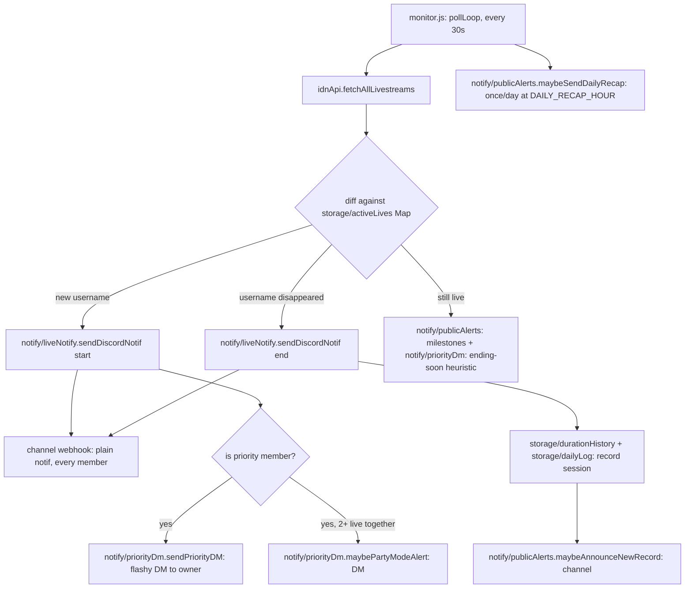

# Architecture

Technical reference for the JKT48 IDN Live Discord notifier. This document assumes no prior context — it should be enough for a new engineer to understand the system, extend it safely, and know where to look when something breaks.

## 1. What this system does

The bot polls IDN Live's public GraphQL API every 30 seconds for livestreams by JKT48 members, and reacts to state changes:

- A member **starts** live → post a notification to a Discord channel (via webhook), optionally with an extra "flashy" DM to the bot owner if that member is on the personal priority list.
- A member **ends** live → post an "ended" notification, record the session's duration/peak-viewer stats.
- Along the way: viewer-count milestones, new personal-duration records, a daily recap, and an optional interactive chat-command bot (`cok ...`) that reads the same data.

It is a single always-on Node.js process (no database — everything is small JSON files), designed to run on Railway with a persistent Volume.

## 2. Directory map

```
scripts/
  cek-top-gifter.js        standalone manual CLI (not part of the 24/7 bot —
                           see §6)
src/
  index.js                 entry point — require("./app").start() (this is
                           what "node src/index.js"/npm start actually runs)
  config.js                env loading + validation + all static config
                           (thresholds, priority member definitions, colors)
  app.js                   start(): wires everything together, the only
                           module (besides index.js/config.js) with real side effects
  security.js               HMAC request-signing helpers (used by src/server.js
                           and scripts/cek-top-gifter.js) — a leaf module like
                           config.js/utils.js, no dependency on the rest of src/
  discordClient.js         shared discord.js Client singleton
  idnApi.js                IDN Live GraphQL client
  server.js                HTTP server (health check + signed endpoints)
  monitor.js               the poll loop — orchestrates idnApi + storage + notify
  utils.js                 pure helpers: formatting, WIB time, text matching
  storage/
    jsonStore.js             generic cached JSON-file load/save factory
    activeLives.js            in-memory Map of who's live right now
    durationHistory.js        per-member rolling history of live durations
    dailyLog.js                today's sessions (for recap/stats commands)
    priorityStore.js           raw persistence for custom priority members
    subscriptions.js           per-user "ping me when X goes live" subscriptions
    gifterSnapshot.js          top-gifter snapshots (pushed from scripts/cek-top-gifter.js)
  priority/
    index.js                  priority-member domain logic (who's priority,
                             the flashy embed builder, the random thank-you
                             message generator)
  notify/
    webhook.js                shared "POST to the channel webhook" helper
    liveNotify.js              the plain start/end channel notification
    priorityDm.js               owner-only DMs: flashy notif, ending-soon
                             heuristic, Party Mode
    publicAlerts.js             viewer milestones, new records, daily recap
  chat/
    router.js                  buildChatReply() dispatcher + Discord event wiring
    replies.js                   pure reply-string builders + recap pagination
    menu.js                       fallback-menu UI + watch-confirm flow
    pendingState.js                short-lived per-user "waiting for a reply" state
data/                    JSON files (see §4) — local fallback; Railway uses a
                         mounted Volume instead (see §9)
```

## 3. Data flow



The channel webhook (`DISCORD_WEBHOOK_URL`) is the only thing every server member sees. Everything under `notify/priorityDm.js` is a **DM to the owner only** — see §6.

## 4. Data model (`data/*.json`)

All files are cached in memory after first read (`storage/jsonStore.js`) and rewritten in full on every save — there's no append-only log or database, so treat them as small enough to always fit in memory (they are, by design: duration history keeps only the last 10 entries per member, daily log resets every WIB day).

| File | Owner module | Shape | Purpose |
|---|---|---|---|
| `active-lives-cache.json` | `storage/activeLives.js` | `{ [username]: { name, slug, liveAt, viewCount, peakViewCount, imageUrl, endingSoonAlerted, alertedMilestones[] } }` | Who's live right now — survives restarts so the bot doesn't re-announce a live already in progress. |
| `live-duration-history.json` | `storage/durationHistory.js` | `{ [username]: [{ name, durationMs, at }] }` (max 10 entries) | Last-10 completed lives per member. Powers `cok stats`, `cok kapan ... live`, and the ending-soon/new-record heuristics. `at` is the **end** timestamp, not start. |
| `daily-log.json` | `storage/dailyLog.js` | `{ date, sessions: [{ name, username, startedAtUnix, endedAtUnix, durationMs, peakViewCount }], recapSentDate }` | Every session (live or ended) for the current WIB day. Resets automatically when `date` no longer matches today. Powers `cok rekap`, `cok paling lama/rame`. |
| `custom-priority.json` | `storage/priorityStore.js` | `[{ rank, keyword, label, color, sirens }]` | Priority members added via `cok tambah prioritas <nama>`, beyond the 3 hardcoded ones (Nala/Levi/Lily). |
| `subscriptions.json` | `storage/subscriptions.js` | `{ [keyword]: [userId, ...] }` | Per-user personal reminders (`cok ingetin <nama>`) — any member, any user, independent of the priority list. |
| `gifter-snapshot.json` | `storage/gifterSnapshot.js` | `{ members: { [username]: { name, gifters, checkedAt } } }` | Point-in-time top-gifter data, pushed from the local `cek-top-gifter` script (§6) — never fetched by the bot itself. |

## 5. Chat command system (`src/chat/`)

`chat/router.js`'s `buildChatReply(text, {isBotChannel, channelId, authorId})` is the single entry point, called from `messageCreate`. Dispatch order matters:

1. **Pending-state shortcuts first** (checked before the wake-word gate, since none of these require saying "cok"): watch-confirm y/n (`chat/menu.js`), recap-page y/n (`chat/replies.js`), menu-shortcut digits (`chat/pendingState.js`), member-name-prompt follow-ups (`chat/pendingState.js`).
2. **Wake-word gate**: the message must contain "cok", OR be in the configured `BOT_CHANNEL_ID`, OR look like a live-related question (contains "live" + a question word/`?`).
3. A long chain of regex/keyword matches against `replies.js` functions, most-specific first (e.g. subscribe commands before the generic priority-list check, since their text overlaps).
4. Falls through to `chat/menu.js`'s `replyFallbackMenu()` — a numbered menu (buttons + typeable digits) rather than silence.

### The 4 short-lived pending-state maps

All keyed `` `${channelId}:${authorId}` `` (never just `channelId`) with a TTL, so two people talking in the same channel never cross-wire each other's in-progress flow:

| Map | Lives in | Set when | Consumed by |
|---|---|---|---|
| `pendingWatchConfirm` | `chat/menu.js` | User picks a live member (menu #4 or `"4 <nama>"`) | y/n → "gas nonton" or a status update |
| `pendingRecapPage` | `chat/replies.js` | A recap table has more pages | y/n → next page or "oke, segitu aja" |
| `pendingMenuByAuthor` | `chat/pendingState.js` | Fallback menu was just shown | Bare digit 1-9 |
| `pendingMemberPrompt` | `chat/pendingState.js` | Menu #4/#9 picked with no name yet | Next message = the member name |

(This replaced an earlier per-channel-only key, which caused a second person's identical digit reply in a shared channel to be misrouted back to the menu instead of resolved — see git history around commit `aca7035`.)

## 6. Priority-member DM architecture

Nala/Levi/Lily (plus anything added via `cok tambah prioritas`) are the bot **owner's** personal favorites, not a server-wide setting. Since a webhook posts one identical message to everyone in the channel, there's no way to make the channel itself look different per viewer — so as of this session, the flashy treatment moved entirely to DMs:

- **Channel** (`notify/liveNotify.js`): every member, priority or not, gets the same plain start/end notification.
- **Owner DM** (`notify/priorityDm.js`, requires `DISCORD_BOT_TOKEN` + `PRIORITY_PING_USER_ID`): the flashy embed (colors, link button, Nala's randomized thank-you message), the "ending soon" duration heuristic, and "Party Mode" (2+ priority members live together) — all sent via `client.users.fetch(id).send(...)`, a private 1:1 DM channel nothing else in the server can read.

If `DISCORD_BOT_TOKEN` is unset, none of this fires — the bot logs that at boot and priority members just get the plain channel notification like anyone else. If it's set but `PRIORITY_PING_USER_ID` is empty, the same degradation happens (logged separately in `chat/router.js`'s `clientReady` handler, specifically so this is checkable from Railway's Deploy Logs alone without needing dashboard access).

`scripts/cek-top-gifter.js` also needs `BOT_API_URL` + `API_SECRET` (see §9) but is a **separate, manually-run** local tool — it is never part of the always-on bot process, since fetching top-gifter data requires a personal IDN login that must never live on a 24/7 server.

## 7. Extension points

- **New chat command**: add a `reply*` function to `chat/replies.js`, then a matcher in `chat/router.js`'s `buildChatReply` chain (order matters — put more specific patterns before broader ones). Add a line to `replyHelp()`.
- **New priority member**: no code change needed — `cok tambah prioritas <nama>` (owner only). To change the 3 hardcoded ones' behavior, edit `PRIORITY_MEMBERS` in `config.js`.
- **New storage domain**: add a file under `storage/`, call `createJsonStore(filePath, defaultValue, { errorLabel })` from `storage/jsonStore.js`, wrap with domain-specific functions. Always pair a `load()` with a `save()` after mutating — the cache assumes nothing mutates without saving.
- **New notification type**: decide first whether it belongs in the shared channel (`notify/liveNotify.js` / `notify/publicAlerts.js`, visible to everyone) or the owner's DM (`notify/priorityDm.js`, visible to nobody else) — see §6 for why that distinction matters.

## 8. Environment variables

| Variable | Required | Default | Effect |
|---|---|---|---|
| `DISCORD_WEBHOOK_URL` | **yes** | — | Bot exits at boot if missing. Channel notifications. |
| `DISCORD_BOT_TOKEN` | no | — | Enables chat commands + priority owner DMs. |
| `PRIORITY_PING_USER_ID` | no | — | Discord user ID that gets priority DMs and owns admin commands (`tambah/hapus prioritas`). |
| `API_SECRET` | no | — | HMAC secret for `/api/status` and `/api/gifter-snapshot`; those endpoints 503 without it. |
| `CACHE_DIR` | no | `RAILWAY_VOLUME_MOUNT_PATH`, else `data/` | Where all JSON files live. |
| `RAILWAY_VOLUME_MOUNT_PATH` | no (set by Railway) | — | Persists data across redeploys when a Volume is attached. |
| `BOT_CHANNEL_ID` | no | — | Channel where the bot replies without needing "cok"/"live". |
| `ENDING_SOON_THRESHOLD_MINUTES` | no | `40` | Fallback threshold (minutes) for the ending-soon DM heuristic when a member has no duration history yet. |
| `DAILY_RECAP_HOUR` | no | `23` | WIB hour the automatic daily recap fires. |
| `PORT` | no | `3000` | HTTP health-check server port. |
| `BOT_API_URL`, `API_SECRET` | no | — | `scripts/cek-top-gifter.js` only — where to push gifter snapshots. |
| `IDN_AUTH_TOKEN`, `IDN_X_API_KEY` | no | prompts interactively | `scripts/cek-top-gifter.js` only — personal IDN credentials, never touches the 24/7 bot. |

## 9. Deployment (Railway)

- `package.json`'s `main`/`scripts.start` point at `src/index.js` (a thin `require("./app").start()`), run via `npm start` — no separate `js/` entry point exists anymore, everything lives under `src/`.
- Attach a Railway **Volume** and Railway auto-populates `RAILWAY_VOLUME_MOUNT_PATH`; `config.js` picks it up automatically (no code change needed) so `data/*.json` survives redeploys instead of resetting.
- `config.js` logs which `CACHE_DIR` is actually active at boot — check Railway's Deploy Logs first if stats/history seem to have reset unexpectedly.
- The HTTP server (`src/server.js`) exists purely so Railway's health check sees an open port; the bot itself is a background poller, not a web service.
